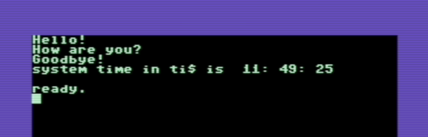

Prog8 - Structured Programming Language for 8-bit 6502/6510 microprocessors
===========================================================================

*Written by Irmen de Jong (irmen@razorvine.net)*

*Software license: GNU GPL 3.0, see file LICENSE*

This is a structured programming language for the 8-bit 6502/6510 microprocessor from the late 1970's and 1980's
as used in many home computers from that era. It is a medium to low level programming language,
which aims to provide many conveniences over raw assembly code (even when using a macro assembler):

- reduction of source code length
- easier program understanding (because it's higher level, and more terse)
- option to automatically run the compiled program in the Vice emulator  
- modularity, symbol scoping, subroutines
- subroutines have enforced input- and output parameter definitions
- various data types other than just bytes (16-bit words, floats, strings, 16-bit register pairs)
- automatic variable allocations, automatic string variables and string sharing
- constant folding in expressions (compile-time evaluation)
- automatic type conversions
- floating point operations
- abstracting away low level aspects such as ZeroPage handling, program startup, explicit memory addresses
- breakpoints, that let the Vice emulator drop into the monitor if execution hits them
- source code labels automatically loaded in Vice emulator so it can show them in disassembly
- conditional gotos
- various code optimizations (code structure, logical and numerical expressions, ...) 

It is mainly targeted at the Commodore-64 machine at this time.

Documentation is online at https://prog8.readthedocs.io/

Required tools:
---------------

`64tass <https://sourceforge.net/projects/tass64/>`_ - cross assembler. Install this on your shell path.
A recent .exe version of this tool for Windows can be obtained from my `clone <https://github.com/irmen/64tass/releases>`_ of this project.
For other platforms it is very easy to compile it yourself (make ; make install).

A **Java runtime (jre or jdk), version 8 or newer**  is required to run the packaged compiler.
If you want to build it from source, you'll need a Kotlin 1.3 SDK as well (or for instance,
IntelliJ IDEA with the Kotlin plugin).

It's handy to have a C-64 emulator or a real C-64 to run the programs on. The compiler assumes the presence
of the `Vice emulator <http://vice-emu.sourceforge.net/>`_.

Example code
------------

When this code is compiled::

    %import c64lib
    %import c64utils
    %import c64flt

    ~ main {
        sub start() {
            ; set text color and activate lowercase charset
            c64.COLOR = 13
            c64.VMCSB |= 2

            ; use optimized routine to write text
            c64scr.print("Hello!\n")

            ; use iteration to write text
            str question = "How are you?\n"
            for ubyte char in question
                c64.CHROUT(char)

            ; use indexed loop to write characters
            str bye = "Goodbye!\n"
            for ubyte c in 0 to len(bye)
                c64.CHROUT(bye[c])

            float clock_seconds = ((mkword(c64.TIME_LO, c64.TIME_MID) as float)
                                    + (c64.TIME_HI as float)*65536.0)
                                     / 60
            float hours = floor(clock_seconds / 3600)
            clock_seconds -= hours*3600
            float minutes = floor(clock_seconds / 60)
            clock_seconds = floor(clock_seconds - minutes * 60.0)

            c64scr.print("system time in ti$ is ")
            c64flt.print_f(hours)
            c64.CHROUT(':')
            c64flt.print_f(minutes)
            c64.CHROUT(':')
            c64flt.print_f(clock_seconds)
            c64.CHROUT('\n')
        }
    }

you get a program that outputs this when loaded on a C-64:

