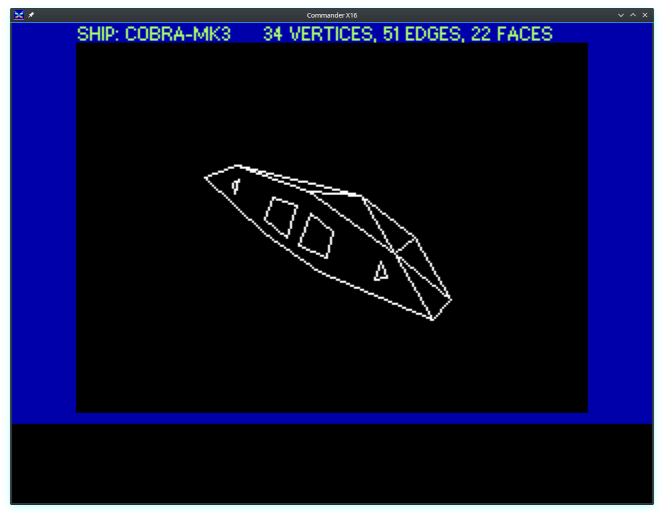

PayPal: 

Prog8 - Structured Programming Language for 8-bit 6502/65c02 microprocessors
============================================================================

*Written by Irmen de Jong (irmen@razorvine.net)*

This is a structured programming language for the 8-bit 6502/6510/65c02 microprocessor from the late 1970's and 1980's
as used in many home computers from that era. It is a medium to low level programming language,
which aims to provide many conveniences over raw assembly code (even when using a macro assembler).

**Want to buy me a coffee or a pizza perhaps?**

This project was created over the last couple of years by dedicating thousands of hours of my free time to it, to make it the best I possibly can.
If you like Prog8, and think it's worth a nice cup of hot coffee or a delicious pizza, 
you can help me out a little bit over at [ko-fi.com/irmen](https://ko-fi.com/irmen) or [PayPal](https://paypal.me/irmendejong)

Documentation
-------------
Full documentation (syntax reference, how to use the language and the compiler, etc.) can be found at:
https://prog8.readthedocs.io/

How to get it/build it
----------------------

- Download the latest [official release](https://github.com/irmen/prog8/releases) from github.
- Or, if you want/need a bleeding edge development version, you can:
  - download a build artifact zipfile from a recent [github action build](https://github.com/irmen/prog8/actions).
  - you can also compile it yourself from source. [Instructions here](https://prog8.readthedocs.io/en/latest/compiling.html).
    Note that if you are not using *gradle* to build it, you might have to perform some manual
    tasks once to make it compile fully. These are explained in the linked instructions. 
- Alternatively, you can also install the compiler as a package on some linux distros:
  - Arch (via AUR): [`prog8`](https://aur.archlinux.org/packages/prog8)

Community
---------
Most of the development on Prog8 and the use of it is currently centered around 
the [Commander X16](https://www.commanderx16.com/) retro computer. Their [discord server](https://discord.gg/nS2PqEC) contains a small channel
dedicated to Prog8. Other than that, use the issue tracker on github.

Software license
----------------
GNU GPL 3.0 (see file LICENSE), with exception for generated code:

- The compiler and its libraries are free to use according to the terms of the GNU GPL 3.0
- *exception:* the resulting files (intermediate source codes and resulting binary program) created by the compiler
  are excluded from the GPL and are free to use in whatever way desired, commercially or not.

What does Prog8 provide?
------------------------

- all advantages of a higher level language over having to write assembly code manually
- programs run very fast because it's compiled to native machine code
- code often is smaller and faster than equivalent C code compiled with CC65 or even LLVM-MOS
- modularity, symbol scoping, subroutines. No need for forward declarations.
- various data types other than just bytes (16-bit words, floats, strings)
- Structs and typed pointers
- floating point math is supported on certain targets
- access to most Kernal ROM routines as external subroutine definitions you can call normally
- tight control over Zeropage usage
- programs can be run multiple times without reloading because of automatic variable (re)initializations.
- programs can be configured to execute in ROM
- strings can contain escaped characters but also many symbols directly if they have a petscii equivalent, such as "♠♥♣♦π▚●○╳". Characters like ^, _, \, {, } and | are also accepted and converted to the closest petscii equivalents.
- automatic static variable allocations, automatic string and array variables and string sharing
- high-level program optimizations
- conditional branches that map 1:1 to cpu status flags
- ``when`` statement to provide a concise jump table alternative to if/elseif chains
- ``on .. goto`` statement for fast jump tables
- ``in`` expression for concise and efficient multi-value/containment check 
- ``defer`` statement to help write concise and robust subroutine cleanup logic
- several specialized built-in functions such as ``lsb``, ``msb``, ``min``, ``max``, ``rol``, ``ror``
- various powerful built-in libraries to do I/O, number conversions, graphics and more  
- subroutines can return more than one result value
- inline assembly allows you to have full control when every cycle or byte matters
- supports the sixteen 'virtual' 16-bit registers R0 - R15 from the Commander X16 (also available on other targets)
- encode strings and characters into petscii or screencodes or even other encodings
- Automatic ROM/RAM bank switching on certain compiler targets when calling routines in other banks
- 50 Kb of available program RAM size on the C64 by default; because Basic ROM is banked out altogether 

*Rapid edit-compile-run-debug cycle:*

- use a modern PC to do the work on, use nice editors and enjoy quick compilation times
- can automatically run the program in the Vice emulator after succesful compilation
- breakpoints, that let the Vice emulator drop into the monitor if execution hits them
- source code labels automatically loaded in Vice emulator so it can show them in disassembly

*Multiple supported compiler targets* (contributions to improve these or to add support for other machines are welcome!):

- "cx16": [CommanderX16](https://www.commanderx16.com)  (65c02 CPU)
- "c64": Commodore-64  (6502 like CPU)
- "c128": Commodore-128  (6502 like CPU - the Z80 cpu mode is not supported)
- "pet32": Commodore PET (limited support)
- via external configurable targets: Atari 800 XL, Neo6502, NES, C64OS, ...
- If you only use standard kernal and prog8 library routines, it is possible to compile the *exact same program* for different machines (just change the compiler target flag)

Additional required tools
-------------------------

[64tass](https://sourceforge.net/projects/tass64/) - cross assembler. Install this on your shell path.
A recent .exe version of this tool for Windows can be obtained from my [clone](https://github.com/irmen/64tass/releases) of this project.
For other platforms it is very easy to compile it yourself (make ; make install).

A **Java runtime (jre or jdk), version 11 or newer**  is required to run a prepackaged version of the compiler.
If you want to build it from source, you'll need a Java SDK + Kotlin 1.3.x SDK (or for instance,
IntelliJ IDEA with the Kotlin plugin).

It's handy to have an emulator (or a real machine perhaps!) to run the programs on. The compiler assumes the presence
of the [Vice emulator](http://vice-emu.sourceforge.net/)  for the C64 target,
and a recent emulator version (R42 or newer) for the CommanderX16, such as [x16emu](https://cx16forum.com/forum/viewforum.php?f=30) 
(preferred, this is the official emulator. If required, source code is [here](https://github.com/X16Community/x16-emulator/)).
There is also [Box16](https://github.com/indigodarkwolf/box16) which has powerful debugging features.

**Syntax highlighting:** for a few different editors, syntax highlighting definition files are provided.
Look in the [syntax-files](https://github.com/irmen/prog8/tree/master/syntax-files) directory in the github repository to find them.

Example code
------------

This code calculates prime numbers using the Sieve of Eratosthenes algorithm::

    %import textio
    %zeropage basicsafe

    main {
        bool[256] sieve
        ubyte candidate_prime = 2       ; is increased in the loop
    
        sub start() {
            sys.memset(sieve, 256, 0)   ; clear the sieve
            txt.print("prime numbers up to 255:\n\n")
            ubyte amount=0
            repeat {
                ubyte prime = find_next_prime()
                if prime==0
                    break
                txt.print_ub(prime)
                txt.print(", ")
                amount++
            }
            txt.nl()
            txt.print("number of primes (expected 54): ")
            txt.print_ub(amount)
            txt.nl()
        }
    
        sub find_next_prime() -> ubyte {
            while sieve[candidate_prime] {
                candidate_prime++
                if candidate_prime==0
                    return 0        ; we wrapped; no more primes
            }
    
            ; found next one, mark the multiples and return it.
            sieve[candidate_prime] = true
            uword multiple = candidate_prime
    
            while multiple < len(sieve) {
                sieve[lsb(multiple)] = true
                multiple += candidate_prime
            }
            return candidate_prime
        }
    }

when compiled an ran on a C-64 you'll get:

One of the included examples (wizzine.p8) animates a bunch of sprite balloons and looks like this:

Another example (cube3d-sprites.p8) draws the vertices of a rotating 3d cube:

If you want to play a video game, a fully working Tetris clone is included in the examples:

There are a couple of examples specially made for the CommanderX16 compiler target.
For instance here's a well known space ship animated in 3D with hidden line removal,
in the CommanderX16 emulator:

