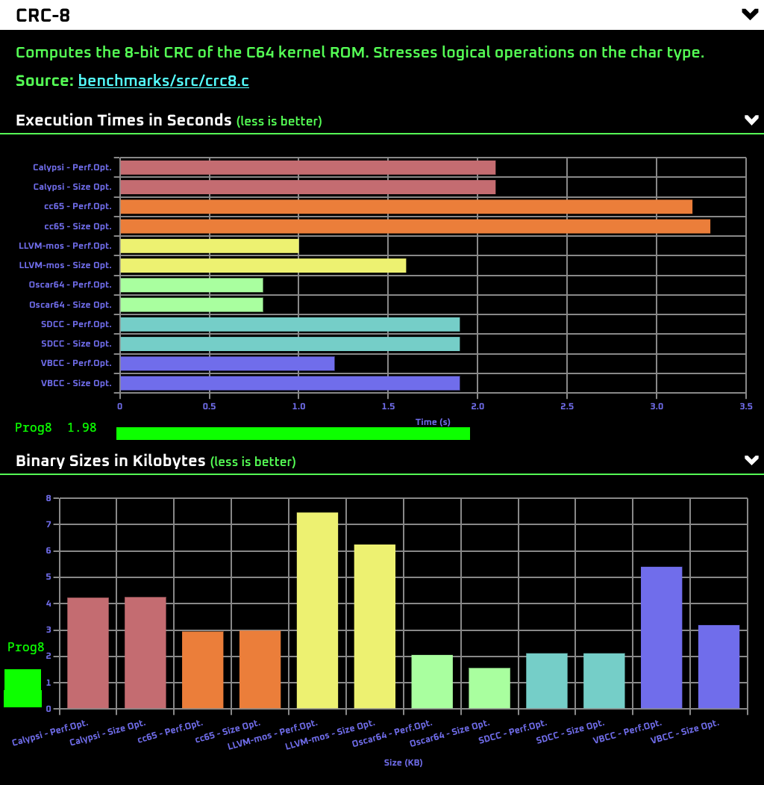
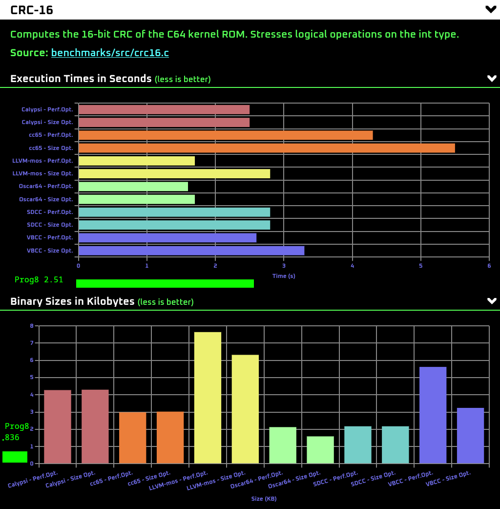
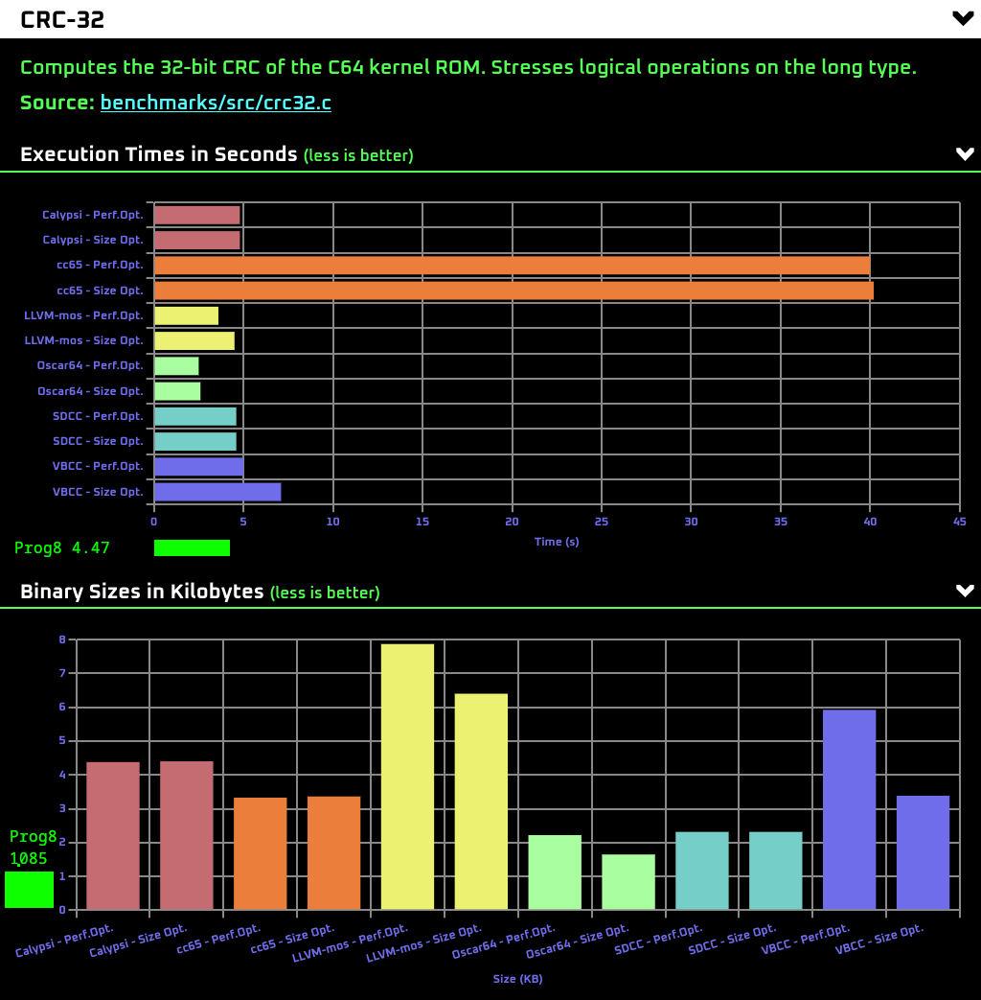
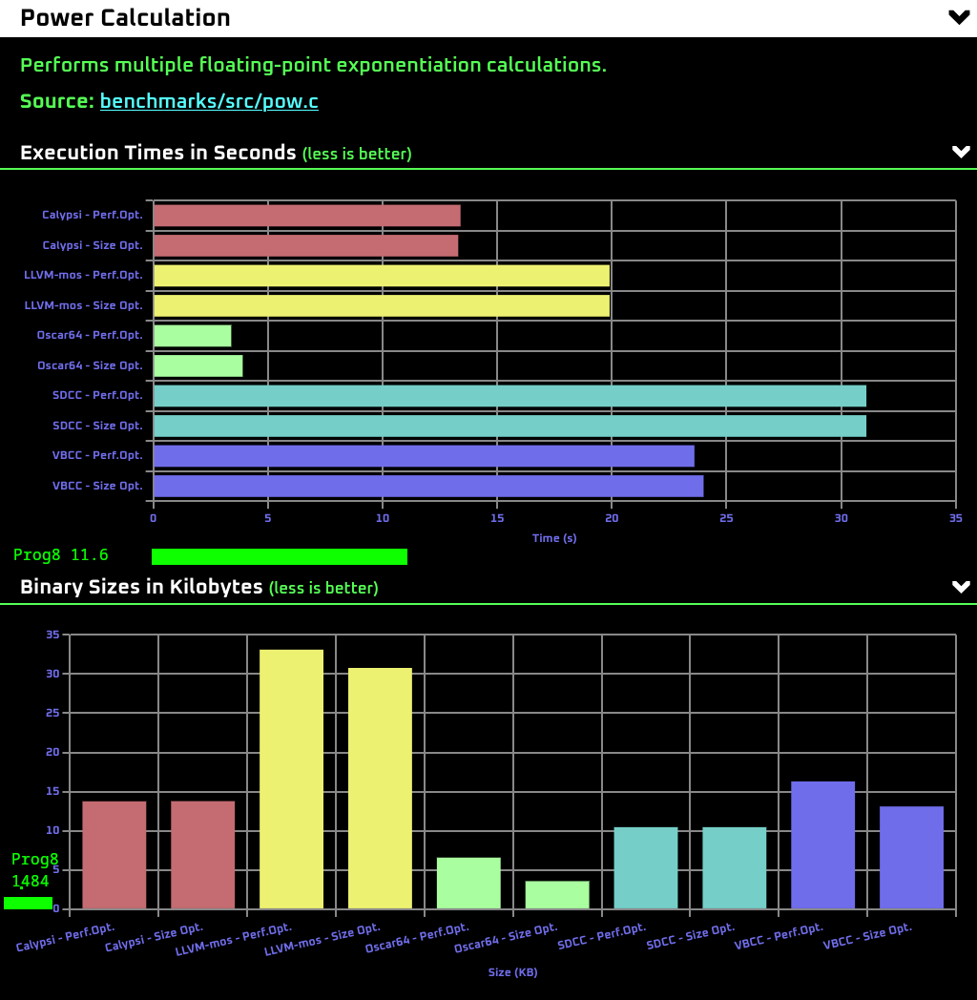
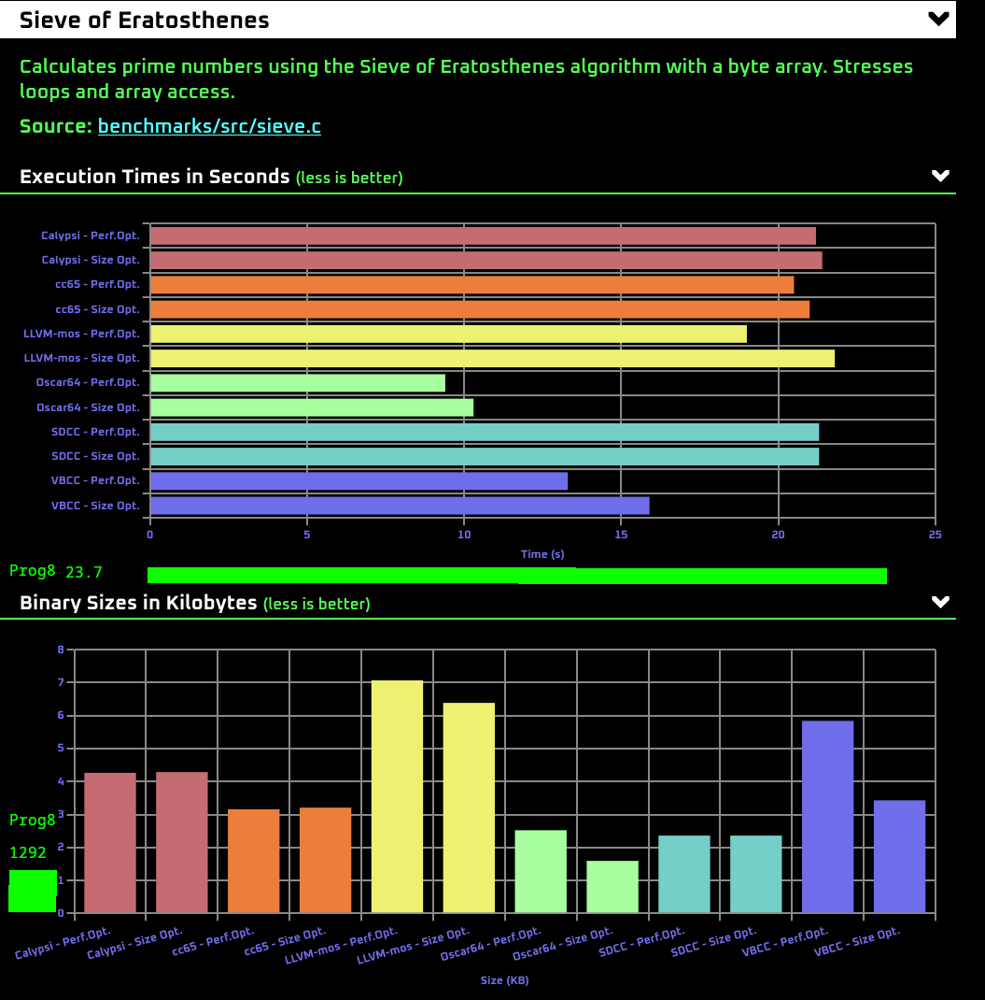
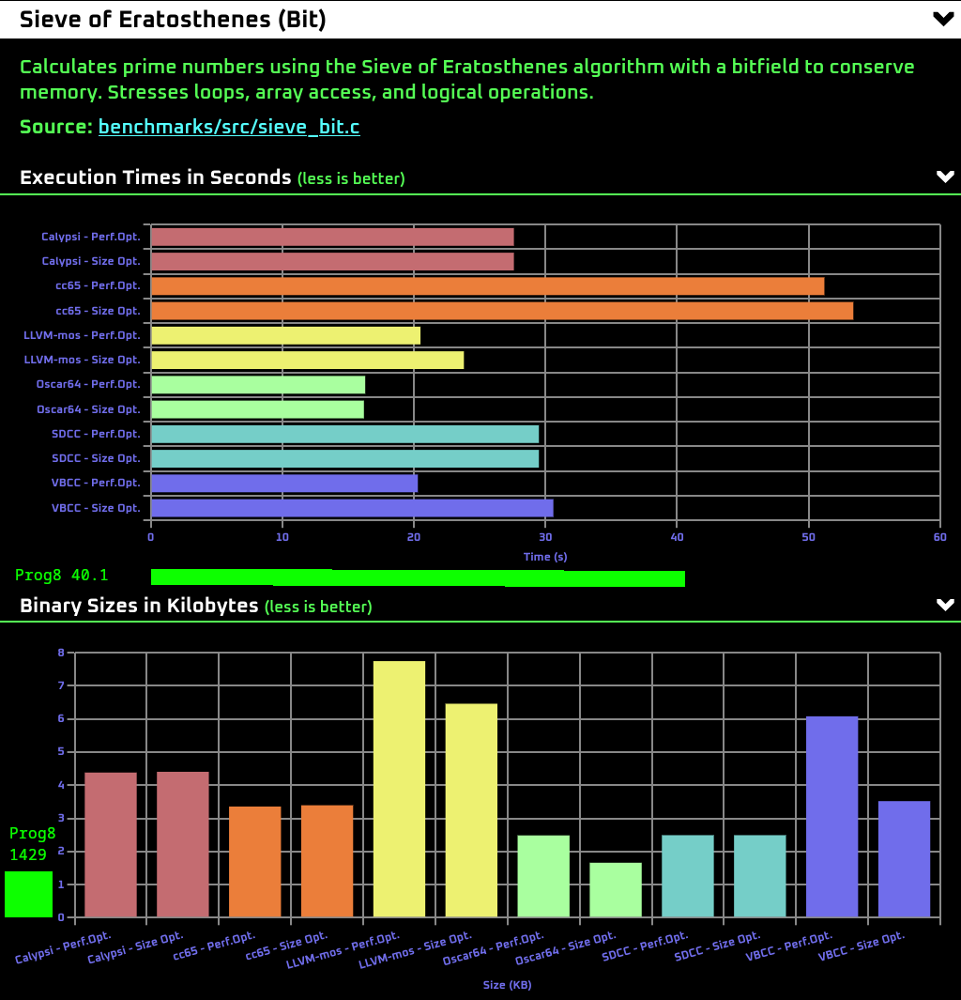

# C-Bench-64 comparison

Several benchmarks of https://thred.github.io/c-bench-64/
have been ported to equivalent Prog8 code and the benchmark results have been penciled in in the graphs below.

Maybe one day I'll try to integrate the prog8 data properly but their benchmark site is comparing C compilers, which Prog8 clearly is not.

However conclusions so far (note: these are micro benchmarks so interpret the results as you will!)

* Prog8 program size is consistently the smallest by a fair bit.
* Prog8 execution speed places it more or less in the middle of the stack.

Measured with Prog8 V12.0 .

