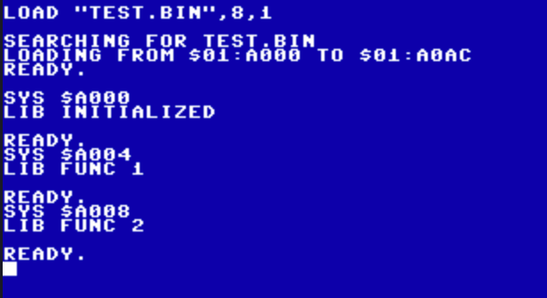

.. _loadable_library:

=========================
Binary Loadable Libraries
=========================

**also called 'Library Blobs'.**

Prog8 allows you to create binary library files that contain routines callable by other programs.
Those programs can be written in Prog8, BASIC, or something else. They just LOAD the binary library
file into memory, and call the routines.

An example of a library file loaded in BASIC on the Commander X16:

(On the Commodore-64 and such, it works identically but you have to type the SYS addresses in decimal notation)

Requirements
^^^^^^^^^^^^

Such a loadable library has to adhere to a few rules:

It can't use zero page variables
    Otherwise it might overwrite variables being used by the calling program.
    For systems that have the 16 'virtual registers' cx16.r0-r15 in zero page:
    these 16 words are free to use. For other systems, only the internal prog8
    zeropage scratch variables can be used.
    *note: this may be improved upon in a future version*

No system initialization and startup code
    The library cannot perform any regular "system initialization" that normal
    Prog8 programs usually perform (such as resetting the IO registers, clearing the screen,
    changing the colors, and other initialization logic). This would disturb the
    state of the calling program!  The library can (must) assume that that the calling
    program has already done all required initialization.

Variable initialization
    The library still has to initialize any variables it might use and clear
    uninitialized "BSS" variables! Otherwise the code will not run predictably as prog8 code.
    So, the library must still have a "start" entrypoint subroutine like any outher prog8 program,
    that must be called before any other library routine can be called.

Binary output and loaded into a fixed memory address
    The library must not have a launcher such as a BASIC SYS command, because
    it is not ran like a normal program.
    Also, because it is not possible to create position independent code with prog8,
    a fixed load address has to be decided on and the library must be compiled
    with that address as the load address.

``%output library``
^^^^^^^^^^^^^^^^^^^
Most of the above requirements can be fulfilled by setting various directives in your
source code such as %launcher, %zeropage and so on. But there is a single directive that does it correctly for you in one go
(and makes sure there won't be any initialization code left at all): ``%output library``

Together with ``%address`` and possibly ``%memtop`` -to tell the compiler what the load address of the library should be-
it will create a "library.bin" file that fulfills the requirements of a loadable binary library program as listed above.

For older CBM targets (C64, C128 and PET) the library file will have a load address header,
because these targets require a header to easily load files. For the other targets such as the Commander X16,
the library will be a headerless binary file that can then be loaded given the correct load address.

The entrypoint (= the start subroutine) that must be called to initialize the variables,
will be the very first thing at the beginning of the library.

Jump table
^^^^^^^^^^

For ease of use, libraries should probably have a fixed "jump table" where the offsets of the
library routines stay the same across different versions of the library. Without needing new syntax,
there's a trick in Prog8 that you can use to build such a jumptable:
add a non-splitted word array at the top of the library main block that contains JMP instructions
and the addresses of the individual library subroutines. Do NOT change the order of the subroutines
in this table!
Also note that the Prog8 compiler will insert a single JMP instruction at the very start of the library,
that jumps to the start subroutine (= the entrypoint of the library program).
Users of the library need to call this to initialize the variables, so it is a required part of the
external interface of the library.
Because the compiler will place the global word array jumptable immediately after this JMP instruction,
it seems as if the very first entry in the jump table is the jump to the start routine.

Look at the generated assembly code to see exactly what is going on.
But the users of the library are none the wiser and it just seems as if it is part of the jump table in a natural way :-)

Loading and using the library
^^^^^^^^^^^^^^^^^^^^^^^^^^^^^

These examples below assume the target is the Commander X16.
Assuming the load address of the library is $A000:

**From BASIC**::

    BLOAD "LIBRARY.BIN",8,1,$A000
    SYS $A000 : REM TO INITIALIZE VARIABLES, REQUIRED!
    SYS $A004 : REM CALL FIRST ROUTINE
    SYS $A008 : REM CALL SECOND ROUTINE, ETC.

**From Prog8**::

    %import diskio

    main {

        extsub $A000 = lib_init() clobbers(A)
        extsub $A004 = lib_func1() clobbers(A,X,Y)
        extsub $A008 = lib_func2() clobbers(A,X,Y)

        sub start() {
            if diskio.load_raw("library.bin", $a000) != 0 {
                lib_init()
                lib_func1()
                lib_func2()

                repeat { }
            }
        }
    }

**From C**::

    #include <cbm.h>

    int main() {
        void (*lib_init)(void) = (void (*)()) 0xa000;
        void (*lib_func1)(void) = (void (*)()) 0xa004;
        void (*lib_func2)(void) = (void (*)()) 0xa008;

	    cbm_k_setlfs(0, 8, 2);
	    cbm_k_setnam("library.bin");
	    cbm_k_load(0, 0xa000);

        lib_init();
        lib_func1();
        lib_func2();
        return 0;
    }

**From Assembly**::

    ; add error handling as desired.
        ldy  #>libname
        ldx  #<libname
        lda  #11
        jsr  $ffbd      ; SETNAM
        lda  #0
        ldx  #8
        ldy  #2         ; load address override
        jsr  $ffba      ; SETLFS
        lda  #0
        ldx  #<$a000
        ldy  #>$a000
        jsr  $ffd5      ; LOAD
        lda  #13
        jsr  $ffd2      ; CHROUT

        jsr  $A000      ; library init
        jsr  $A004      ; lib func 1
        jsr  $A008      ; lib func 2

        rts

        libname:
            .text  "library.bin"

Example library code
^^^^^^^^^^^^^^^^^^^^

Here is the small example library that was used in the example at the beginning of this chapter::

    %address  $A000
    %memtop   $C000
    %output   library

    %import textio

    main {
        ; Create a jump table as first thing in the library.
        uword[] @shared @nosplit jumptable = [
            ; NOTE: the compiler has inserted a single JMP instruction at the start
            ; of the 'main' block, that jumps to the start() routine.
            ; This is convenient because the rest of the jump table simply follows it,
            ; making the first jump neatly be the required initialization routine
            ; for the library (initializing variables and BSS region).
            ; Btw, $4c = opcode for JMP.
            $4c00, &library.func1,
            $4c00, &library.func2,
        ]

        sub start() {
            ; has to be here for initialization
            txt.print("lib initialized\n")
        }
    }

    library {
        sub func1() {
            txt.print("lib func 1\n")
        }

        sub func2() {
            txt.print("lib func 2\n")
        }
    }
