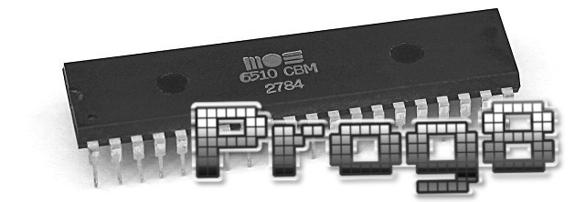
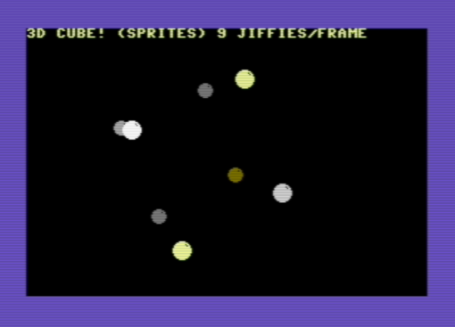
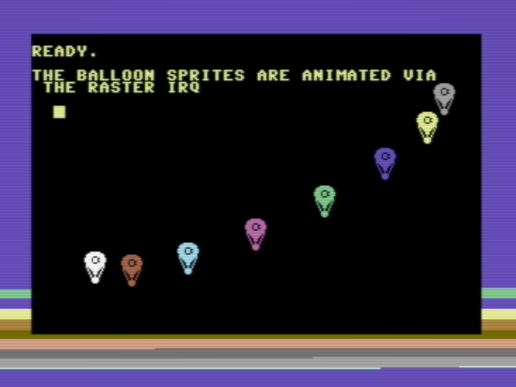
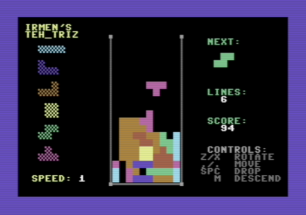
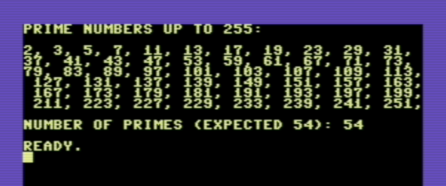
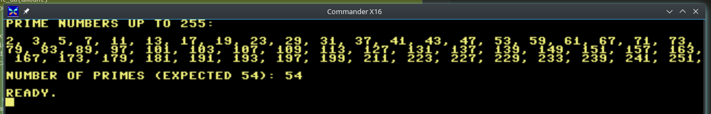

Prog8 documentation - |version|
===============================

.. index:: what is Prog8

What is Prog8?
--------------

This is a compiled programming language targeting the 8-bit
`6502 <https://en.wikipedia.org/wiki/MOS_Technology_6502>`_ /
`6510 <https://en.wikipedia.org/wiki/MOS_Technology_6510>`_ /
`65c02 <https://en.wikipedia.org/wiki/MOS_Technology_65C02>`_ microprocessors.
This CPU is from the late 1970's and early 1980's and was used in many home computers from that era,
such as the `Commodore-64 <https://en.wikipedia.org/wiki/Commodore_64>`_.
The language aims to provide many conveniences over raw assembly code (even when using a macro assembler),
while still being low level enough to create high performance programs.

Prog8 is copyright © Irmen de Jong (irmen@razorvine.net | http://www.razorvine.net).
The project is on github: https://github.com/irmen/prog8.git

This software is licensed under the GNU GPL 3.0, see https://www.gnu.org/licenses/gpl.html

Language features
-----------------

- It is a cross-compiler running on modern machines (Linux, MacOS, Windows, ...)
  It generates a machine code program runnable on actual 8-bit 6502 hardware.
- Fast execution speed due to compilation to native assembly code. It's possible to write certain raster interrupt 'demoscene' effects purely in Prog8.
- Provides a very convenient edit/compile/run cycle by being able to directly launch
  the compiled program in an emulator and provide debugging information to this emulator.
- Based on simple and familiar imperative structured programming (it looks like a mix of C and Python)
- Modular programming and scoping via modules, code blocks, and subroutines.
- Provide high level programming constructs but at the same time stay close to the metal;
  still able to directly use memory addresses and ROM subroutines,
  and inline assembly to have full control when every register, cycle or byte matters
- Subroutines with parameters and return values
- Complex nested expressions are possible
- Variables are allocated statically
- Nested subroutines can access variables from outer scopes to avoids the overhead to pass everything via parameters
- Variable data types include signed and unsigned bytes and words, arrays, strings.
- Floating point math also supported if the target system provides floating point library routines (C64 and Cx16 both do).
- Strings can contain escaped characters but also many symbols directly if they have a petscii equivalent, such as "♠♥♣♦π▚●○╳". Characters like ^, _, \\, {, } and | are also accepted and converted to the closest petscii equivalents.
- High-level code optimizations, such as const-folding, expression and statement simplifications/rewriting.
- Many built-in functions, such as ``sin``, ``cos``, ``rnd``, ``abs``, ``min``, ``max``, ``sqrt``, ``msb``, ``rol``, ``ror``, ``swap``, ``sort`` and ``reverse``
- Programs can be run multiple times without reloading because of automatic variable (re)initializations.
- Supports the sixteen 'virtual' 16-bit registers R0 .. R15 from the Commander X16, also on the C64.
- If you only use standard kernal and prog8 library routines, it is possible to compile the *exact same program* for both machines (just change the compiler target flag)!

Code example
------------

Here is a hello world program::

    %import textio

    main {
        sub start() {
            txt.print("hello world i ♥ prog8\n")
        }
    }

This code calculates prime numbers using the Sieve of Eratosthenes algorithm::

    %import textio
    %zeropage basicsafe

    main {
        ubyte[256] sieve
        ubyte candidate_prime = 2       ; is increased in the loop

        sub start() {
            ; clear the sieve, to reset starting situation on subsequent runs
            sys.memset(sieve, 256, false)
            ; calculate primes
            txt.print("prime numbers up to 255:\n\n")
            ubyte amount=0
            repeat {
                ubyte prime = find_next_prime()
                if prime==0
                    break
                txt.print_ub(prime)
                txt.print(", ")
                amount++
            }
            txt.nl()
            txt.print("number of primes (expected 54): ")
            txt.print_ub(amount)
            txt.nl()
        }

        sub find_next_prime() -> ubyte {
            while sieve[candidate_prime] {
                candidate_prime++
                if candidate_prime==0
                    return 0        ; we wrapped; no more primes available in the sieve
            }

            ; found next one, mark the multiples and return it.
            sieve[candidate_prime] = true
            uword multiple = candidate_prime

            while multiple < len(sieve) {
                sieve[lsb(multiple)] = true
                multiple += candidate_prime
            }
            return candidate_prime
        }
    }

when compiled an ran on a C-64 you get this:

when the exact same program is compiled for the Commander X16 target, and run on the emulator, you get this:

Getting the compiler
--------------------

Usually you just download a fat jar of an official released version, but you can also build
it yourself from source.
Detailed instructions on how to obtain a version of the compiler are in :ref:`building_compiler`.

.. _requirements:

Required additional tools
-------------------------

`64tass <https://sourceforge.net/projects/tass64/>`_ - cross assembler. Install this on your shell path.
It's very easy to compile yourself.
A recent precompiled .exe (only for Windows) can be obtained from my `clone <https://github.com/irmen/64tass/releases>`_ of this project.
*You need at least version 1.55.2257 of this assembler to correctly use the breakpoints feature.*
It's possible to use older versions, but it is very likely that the automatic Vice breakpoints won't work with them.

A **Java runtime (jre or jdk), version 11 or newer**  is required to run the prog8 compiler itself.
If you're scared of Oracle's licensing terms, most Linux distributions ship OpenJDK in their packages repository instead.
For Windows it's possible to get that as well; check out `AdoptOpenJDK <https://adoptopenjdk.net/>`_ .
For MacOS you can use the Homebrew system to install a recent version of OpenJDK.

Finally: an **emulator** (or a real machine ofcourse) to test and run your programs on.
In C64 mode, the compiler assumes the presence of the `Vice emulator <http://vice-emu.sourceforge.net/>`_.
If you're targeting the CommanderX16 instead, there's the `x16emu <https://github.com/commanderx16/x16-emulator>`_.

.. attention:: **Commander-X16 V38 versus V39**

    Starting with Prog8 7.0 the CX16 compilation target is configured for the upcoming v39 version of the emulator
    and roms, that are most accurately reflecting the current state of the hardware design of the CX16.
    Unfortunately, v39 has not yet been officially released. At the time of writing, v38 is still
    the latest official release. So, you have to either compile the v39 emulator+roms from the source in git yourself
    or obtain a precompiled version from someone else.
    A cx16 program compiled by prog8 7.0 is meant for v39 but *may* still work on the older v38 release of the emulator!
    For this to work you should make sure that the program is not using floating point, nor the ram/rom bank switching logic provided by the libraries.
    You can also choose to just stick with Prog8 6.4 (which still targets cx16 v38) and wait it out till
    the emulator v39 is officially released - but you won't be able to benefit from the compiler improvements
    made since the previous release of prog8.

.. toctree::
    :maxdepth: 2
    :caption: Contents of this manual:

    building.rst
    programming.rst
    syntaxreference.rst
    libraries.rst
    targetsystem.rst
    technical.rst
    todo.rst

Index
=====

* :ref:`genindex`
