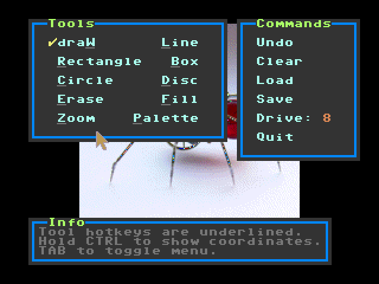
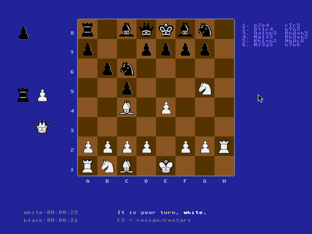

*************************************
What is Prog8?
*************************************

This is a compiled programming language targeting the 8-bit 6502 CPU family.
The language aims to provide many conveniences over raw assembly code (even when using a macro assembler),
while still being low level enough to create high performance programs.

They targeted CPUs are the `6502 <https://en.wikipedia.org/wiki/MOS_Technology_6502>`_ /
`6510 <https://en.wikipedia.org/wiki/MOS_Technology_6510>`_ /
`65c02 <https://en.wikipedia.org/wiki/MOS_Technology_65C02>`_ microprocessors.
They are from the late 1970's and early 1980's and was used in many home computers from that era,
such as the `Commodore 64 <https://en.wikipedia.org/wiki/Commodore_64>`_.

You can compile programs for various machines that are built in into the compiler:

* Commander X16  (with 65c02 cpu, 65816 cpu specifics are currently not supported by prog8 itself)
* Commodore 64
* Commodore 128 (limited support)
* Commodore PET (limited support)
* any other 65(C)02 target machine or setup can be configured to a great extent in a user written configuration file.
  There are some examples included for the Atari 800 XL, NEO6502, Foenix F256, and such.
* some users have been experimenting with a NES and a C64 OS target as well.

Some language features are mentioned below, and you can also read :ref:`comparingprog8` if you
want to quickly read about how Prog8 compares to well-known other languages.

Community
^^^^^^^^^
Most of the development on Prog8 and the use of it is currently centered around
the `Commander X16 <https://www.commanderx16.com/>`_ retro computer.
However, the other compiler targets are also still worked on,  most notably the C64 target where it all started with!

The X16 `Discord server <https://discord.gg/nS2PqEC>`_ contains a small channel
dedicated to Prog8. Besides that, you can use the issue tracker on github for questions or problems or contributions.

Want to buy me a coffee or a pizza perhaps?
^^^^^^^^^^^^^^^^^^^^^^^^^^^^^^^^^^^^^^^^^^^
This project was created over the last couple of years by dedicating thousands of hours of my free time to it, to make it the best I possibly can.
If you like Prog8, and think it's worth a nice cup of hot coffee or a delicious pizza,
you can help me out a little bit over at https://ko-fi.com/irmen or https://paypal.me/irmendejong .

.. image:: _static/cube3d.png
    :width: 33%
    :alt: 3d rotating sprites
.. image:: _static/wizzine.png
    :width: 33%
    :alt: Simple wizzine sprite effect
.. image:: _static/tehtriz.png
    :width: 33%
    :alt: Fully playable tetris clone

.. image:: _static/rrgame.png
    :width: 33%
    :alt: BoulderDash(tm) clone for the X16

Language Features
^^^^^^^^^^^^^^^^^

- it is a cross-compiler running on modern machines (Linux, MacOS, Windows, ...)
- the compiled programs run very fast, because compilation to highly efficient native machine code.
- compiled code is very compact; it is much smaller and usually also runs faster than equivalent C code compiled with CC65
- provides a convenient and fast edit/compile/run cycle by being able to directly launch
  the compiled program in an emulator and provide debugging information to this emulator.
- the language looks like a mix of Python and C so should be quite easy to learn
- Modular programming, scoping via module source files, code blocks, and subroutines. No need for forward declarations.
- Provides high level programming constructs but at the same time stay close to the metal;
  still able to directly use memory addresses and ROM subroutines,
  and inline assembly to have full control when every register, cycle or byte matters
- Variables are all allocated statically, no memory allocation overhead
- Variable data types include signed and unsigned bytes and words, long integers, floats, arrays, and strings.
- Structs and typed pointers
- Tight control over Zeropage usage
- Programs can be restarted after exiting (i.e. run them multiple times without having to reload everything), due to automatic variable (re)initializations.
- Programs can be configured to execute in ROM
- Conditional branches for status flags that map 1:1 to processor branch instructions for optimal efficiency
- ``when`` statement to avoid if-else chains
- ``on .. goto`` statement for fast jump tables
- ``in`` expression for concise and efficient multi-value/containment test
- ``defer`` statement to help write concise and robust subroutine cleanup logic
- Several specialized built-in functions, such as ``lsb``, ``msb``, ``min``, ``max``, ``rol``, ``ror``
- Various powerful built-in libraries to do I/O, number conversions, graphics and more
- Floating point math is supported on certain compiler targets.
- Provides access to most Kernal ROM routines as external subroutine definitions you can call normally.
- Strings can contain escaped characters but also many symbols directly if they have a PETSCII equivalent, such as "♠♥♣♦π▚●○╳". Characters like ^, _, \\, {, } and | are also accepted and converted to the closest PETSCII equivalents.
- Encode strings and characters into petscii or screencodes or even other encodings, as desired (C64/Cx16)
- Automatic ROM/RAM bank switching on certain compiler targets when calling routines in other banks
- Identifiers can contain Unicode Letters, so ``knäckebröd``, ``приблизительно``, ``見せしめ`` and ``π`` are all valid identifiers.
- Subroutines can return more than one result value
- Advanced code optimizations to make the resulting program smaller and faster
- Supports the sixteen 'virtual' 16-bit registers R0 to R15 as defined on the Commander X16. You can look at them as general purpose global variables. These are also available on the other compilation targets!
- On the Commander X16: Support for low level system features such as Vera Fx, which includes 16x16 bits multiplication in hardware and fast memory copy and fill.
- 50 Kb of available program RAM size on the C64 by default; because Basic ROM is banked out altogether
- 41 Kb of available program RAM size on the C128 by default; because Basic ROM is banked out altogether
- Many library routines are available across compiler targets. This means that as long as you only use standard Kernal
  and core prog8 library routines, it is sometimes possible to compile the *exact same program* for different machines by just changing the compilation target flag.

Code example
------------

Here is a hello world program::

    %import textio
    %zeropage basicsafe

    main {
        sub start() {
            txt.print("hello world i ♥ prog8\n")
        }
    }

This code calculates prime numbers using the Sieve of Eratosthenes algorithm::

    %import textio
    %zeropage basicsafe

    main {
        bool[256] sieve
        ubyte candidate_prime = 2       ; is increased in the loop

        sub start() {
            sys.memset(sieve, 256, 0)   ; clear the sieve
            txt.print("prime numbers up to 255:\n\n")
            ubyte amount=0
            repeat {
                ubyte prime = find_next_prime()
                if prime==0
                    break
                txt.print_ub(prime)
                txt.print(", ")
                amount++
            }
            txt.nl()
            txt.print("number of primes (expected 54): ")
            txt.print_ub(amount)
            txt.nl()
        }

        sub find_next_prime() -> ubyte {
            while sieve[candidate_prime] {
                candidate_prime++
                if candidate_prime==0
                    return 0        ; we wrapped; no more primes
            }

            ; found next one, mark the multiples and return it.
            sieve[candidate_prime] = true
            uword multiple = candidate_prime

            while multiple < len(sieve) {
                sieve[lsb(multiple)] = true
                multiple += candidate_prime
            }
            return candidate_prime
        }
    }

when compiled an ran on a C64 you get this:

.. image:: _static/primes_example.png
    :align: center
    :alt: result when run on C64

when the exact same program is compiled for the Commander X16 target, and run on the emulator, you get this:

.. image:: _static/primes_cx16.png
    :align: center
    :alt: result when run on CX16 emulator

.. _downloading:

Getting the software
^^^^^^^^^^^^^^^^^^^^

Usually you just download a fat jar of an official released compiler version, but you can also build it yourself from source.
Detailed instructions on how to obtain a version of the compiler are in :ref:`building_compiler`.
You can also read there what extra tools you need to get going.

You may look for an **emulator** (or a real machine of course) to test and run your programs on.
For the PET, C64 and C128 targets, the compiler assumes the presence of the `VICE emulator <http://vice-emu.sourceforge.net/>`_.
If you're targeting the Commander X16 instead,
download a recent emulator version for the CommanderX16, such as `x16emu <https://cx16forum.com/forum/viewforum.php?f=30>`_
(preferred, this is the official emulator. If required, source code is `here <https://github.com/X16Community/x16-emulator/>`_.
There is also `Box16 <https://github.com/indigodarkwolf/box16>`_ which has powerful debugging features.
If multiple options are listed above, you can select which one you want to launch using the ``-emu`` or ``-emu2`` command line options.

**Syntax highlighting:** for a few different editors, syntax highlighting definition files are provided.
Look in the :source:`syntax-files <syntax-files>` directory in the github repository to find them.

**CTags:** for editors that support them, such as Vim, there is an effort by a member of the cummunity to provide "ctags" files for Prog8.
The basic purpose of ctags is to index the definitions from your source code and let you find them easily.
It is not really to find each use of print for example, but to find where print is defined.
Visit `the Github repository <https://github.com/gillham/prog8ctags>`_ for the files and detailed usage information.
