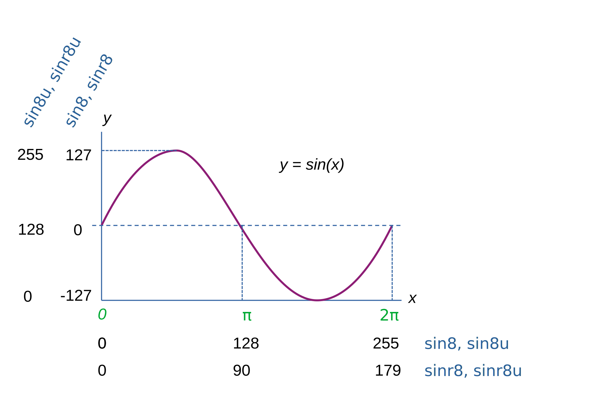

*************************************
Library modules and builtin functions
*************************************

The compiler provides several library modules with useful subroutine and variables.
There are also a bunch of builtin functions.

Some of the libraries may be specific for a certain compilation target, or work slightly different,
but some effort is put into making them available across compilation targets.

This means that as long as your program is only using the subroutines from these
libraries and not using hardware- and/or system dependent code, and isn't hardcoding certain
assumptions like the screen size, the exact same source program can
be compiled for multiple different target platforms. Many of the example programs that come
with Prog8 are written like this.

You can ``%import`` and use these modules explicitly, but the compiler may also import one or more
of these library modules automatically as required.

.. note::
    For full details on what is available in the libraries, please study their source code here:
    :source:`compiler/res/prog8lib`

.. caution::
    The resulting compiled binary program *only works on the target machine it was compiled for*.
    You must recompile the program for every target you want to run it on.

.. note::
    Several algorithms and math routines in Prog8's assembly library files are adapted from
    code publicly available on https://www.codebase64.net/

.. _builtinfunctions:

Built-in Functions
------------------
There's a set of predefined functions in the language. These are fixed and can't be redefined in user code.
You can use them in expressions and the compiler will evaluate them at compile-time if possible.

Array operations
^^^^^^^^^^^^^^^^

len (x)
    Number of values in the array value x, or the number of characters in a string (excluding the 0-byte).
    Note: this can be different from the number of *bytes* in memory if the datatype isn't a byte. See sizeof().
    Note: lengths of strings and arrays are determined at compile-time! If your program modifies the actual
    length of the string during execution, the value of len(s) may no longer be correct!
    (use the ``strings.length`` routine if you want to dynamically determine the length by counting to the
    first 0-byte)

Math
^^^^

abs (x)
    Returns the absolute value of a number (integer or floating point).

clamp (value, minimum, maximum)
    Returns the value restricted to the given minimum and maximum.
    Supported for integer types only, for floats use ``floats.clampf()`` instead.

divmod (dividend, divisor, quotient, remainder)
    Performs division only once and returns both quotient and remainder in a single call, where using '/' and '%' separately
    would perform the division operation twice.
    All values are ubytes or all are uwords.
    The last two arguments must be variables to receive the quotient and remainder results, respectively.

max (x, y)
    Returns the largest of x and y. Supported for integer types only, for floats use ``floats.maxf()`` instead.

min (x, y)
    Returns the smallest of x and y. Supported for integer types only, for floats use ``floats.minf()`` instead.

sgn (x)
    Get the sign of the value (integer or floating point).
    The result is a byte: -1, 0 or 1 (negative, zero, positive).

sqrt (x)
    Returns the square root of the number.
    Accepts unsigned integer (result is ubyte), long (result is uword, but this may not be implemented on all targets), and floating point numbers.
    To do the reverse - squaring a number - just write ``x*x``.

Miscellaneous
^^^^^^^^^^^^^

cmp (x,y)
    Compare the integer value x to integer value y. Doesn't return a value or boolean result, only sets the processor's status bits!
    You can use a conditional jumps (``if_cc`` etcetera) to act on this.
    Normally you should just use a comparison expression (``x < y``)

lsb (x)
    Get the least significant (lower) byte of the value x. Equivalent to ``x & 255`` or even ``x as ubyte``.

lsw (x)
    Get the least significant (lower) word of the value x. Equivalent to ``x & 65535`` or even ``x as uword``.

msb (x)
    Get the most significant (highest) byte of the word or long value x.

msw (x)
    Get the most significant (higher) word of the value x. For all word and byte numbers this will always result in 0.
    For a long integer though, it returns the upper 16 bits of x as an uword.
    If x is a constant integer not greater than a 24 bit number ($ffffff), ``msw(x)`` will actually give you the bank byte of x (bits 16 to 23).
    You can treat this as an ubyte value, even if the function is normally returning a uword:
    ``msw($123456)`` is $0012, which you can treat as an ubyte.  ``msw($12345678)`` is $1234, an uword.
    ``msw`` of a *variable* will always be considered to be an uword, so to grab the bank byte of a long variable, you need to do this:
    ``lsb(msw(longvariable))`` (or the equivalent, ``@(&longvariable+2)``).

mkword (msb, lsb)
    Efficiently create a word value from two bytes (the msb and the lsb). Avoids multiplication and shifting.
    So mkword($80, $22) results in $8022.

    .. note::
        The arguments are in 'natural' left to right reading order that is first the msb then the lsb.
        Don't get confused by how the system actually stores this 16-bit word value in memory (which is
        in little-endian format, so lsb first then msb)

mklong (msb, b2, b1, lsb)
    Efficiently create a long value from four bytes (the msb, second, first and finally the lsb). Avoids multiplication and shifting.
    So mklong($12, $34, $56, $78) results in $12345678.

    .. note::
        The arguments are in 'natural' left to right reading order that is first the msb then the lsb.
        Don't get confused by how the system actually stores this 32-bit word value in memory (which is
        in little-endian format, so lsb first then b1, b2 and finally the msb)

mklong2 (msw, lsw)
    Efficiently create a long value from two words (the msw, and the lsw). Avoids multiplication and shifting.
    So mklong2($1234, $abcd) results in $1234abcd.

    .. note::
        The arguments are in 'natural' left to right reading order that is first the msw then the lsw.
        Don't get confused by how the system actually stores this 32-bit word value in memory (which is
        in little-endian format, so lsw first then the msw)

offsetof (Struct.field)
    The offset in bytes of the given field in the struct. The first field will always have offset 0.
    Usually you just reference the fields directly but in some cases it might be useful to know how many
    bytes from the start of the structure a field is located at.

peek (address)
    same as @(address) - reads the byte at the given address in memory.

peekbool (address)
    Reads the boolean value (byte 0 or 1) at the given address in memory and returns it.
    If the memory location contains another value than 0 or 1, results are undefined.

peekw (address)
    reads the word value at the given address in memory. Word is read as usual little-endian lsb/msb byte order.
    Caution: when using peekw to get words out of an array pointer, make sure the array is *not* a split word array
    (peekw requires the LSB and MSB of the word value to be consecutive in memory).

peekl (address)
    reads the signed long value at the given address in memory. Long is read as usual little-endian lsb/msb byte order.

peekf (address)
    reads the float value at the given address in memory. On CBM machines, this reads 5 bytes.

poke (address, value)
    same as @(address)=value - writes the byte value at the given address in memory.

pokebool (address, value)
    Writes the boolean value at the given address in memory, as byte 0 or 1.
    Can also be written as pokebowl(addres, value), just for fun.

pokew (address, value)
    writes the word value at the given address in memory, in usual little-endian lsb/msb byte order.

pokel (address, value)
    writes the signed long value at the given address in memory, in usual little-endian lsb/msb byte order.

pokef (address, value)
    writes the float value at the given address in memory. On CBM machines, this writes 5 bytes.

pokemon (address, value)
    Like poke(), but also returns the previous value in the given address.
    Also doesn't have anything to do with a certain video game.

rol (x)
    Rotate the bits in x (byte or word) one position to the left.
    This uses the CPU's rotate semantics: bit 0 will be set to the current value of the Carry flag,
    while the highest bit will become the new Carry flag value.
    (essentially, it is a 9-bit or 17-bit rotation)
    Modifies in-place, doesn't return a value (so can't be used in an expression).
    You can rol a memory location directly by using the direct memory access syntax, so like ``rol(@($5000))``
    You can use ``if_cc`` or ``if_cs`` after a rol to act on the new carry bit, if required.

rol2 (x)
    Like ``rol`` but now as 8-bit or 16-bit rotation.
    It uses some extra logic to not consider the carry flag as extra rotation bit.
    Modifies in-place, doesn't return a value (so can't be used in an expression).
    You can rol a memory location directly by using the direct memory access syntax, so like ``rol2(@($5000))``

ror (x)
    Rotate the bits in x (byte or word) one position to the right.
    This uses the CPU's rotate semantics: the highest bit will be set to the current value of the Carry flag,
    while bit 0 will become the new Carry flag value.
    (essentially, it is a 9-bit or 17-bit rotation)
    Modifies in-place, doesn't return a value (so can't be used in an expression).
    You can ror a memory location directly by using the direct memory access syntax, so like ``ror(@($5000))``
    You can use ``if_cc`` or ``if_cs`` after a ror to act on the new carry bit, if required.

ror2 (x)
    Like ``ror`` but now as 8-bit or 16-bit rotation.
    It uses some extra logic to not consider the carry flag as extra rotation bit.
    Modifies in-place, doesn't return a value (so can't be used in an expression).
    You can ror a memory location directly by using the direct memory access syntax, so like ``ror2(@($5000))``

setlsb (x, value)
    Sets the least significant byte of word variable x to a new value. Leaves the MSB untouched.

setmsb (x, value)
    Sets the most significant byte of word variable x to a new value. Leaves the LSB untouched.

sizeof (name)  ;  sizeof (number)  ;  sizeof(datatype)
    The constant number of bytes that the object 'name', the number 'number' or the type 'datatype' occupies in memory.
    For instance, for a variable of type uword, the sizeof is 2.
    For an 10 element array of floats, it is 50 (on the C64, where a float is 5 bytes).
    For a string, it returns the size of the string in memory (which includes the 0-byte terminator at the end)
    Note: usually you will be interested in the number of elements in an array, or the number of characters in the string; use len() for that.

memory (name, size, alignment)
    Returns the address of the first location of a statically "reserved" block of memory of the given size in bytes,
    with the given name. The name must be a string literal, it cannot be empty or be a variable.
    The block is *uninitialized memory*; unlike other variables in Prog8 it is *not* set to zero at the start of the program!
    (if that is required, you can do so yourself using ``memset``).
    No *dynamic* allocation is done; the block with this name is placed in memory only once!
    If you specify an alignment value >1, it means the block of memory will
    be aligned to such a dividable address in memory, for instance an alignment of $100 means the
    memory block is aligned on a page boundary, and $2 means word aligned (even addresses).
    Requesting the address of such a named memory block again later with
    the same name, will result in the same address as before.
    When reusing blocks in that way, it is required that the size argument is the same,
    otherwise you'll get a compilation error.
    This routine can be used to "reserve" parts of the memory where a normal byte array variable would
    not suffice; for instance if you need more than 256 consecutive bytes.
    The return value is an uword address, and you can use that like a pointer to the memory buffer.

call (address) -> uword
    Calls a subroutine given by its memory address. You cannot pass arguments directly,
    although it is ofcourse possible to do this via the global ``cx16.r0...`` registers for example.
    It is *not* possible to use cpu registers to pass arguments, because these are clobbered while performing the call!
    It is assumed the subroutine returns a word value (in AY), if it does not, just add void to the call to ignore the result value.
    This function effectively creates an "indirect JSR" if you use it on a ``uword`` pointer variable.
    But because it doesn't handle bank switching etcetera by itself,
    it is a lot faster than ``callfar``. And it works on other systems than just the Commander X16.

callfar (bank, address, argumentword) -> uword
    Calls an assembly routine in another bank.
    Be aware that ram OR rom bank may be changed depending on the address it jumps to!
    The argumentword will be loaded into the A+Y registers before calling the routine.
    The uword value that the routine returns in the A+Y registers, will be returned.
    NOTE: this routine is very inefficient, so don't use it to call often. Set the bank yourself
    or even write a custom tailored trampoline routine that you reuse. Or use ``call`` if you can.

callfar2 (bank, address, argA, argX, argY, argCarry) -> uword
    Identical to ``callfar``, except here you can give arguments not only for AY,
    but for each of the A, X and Y registers (each an ubyte) and the Carry status bit as well (a boolean).

rsave
    Saves all registers including status (or only X) on the stack
    Note: the 16 bit 'virtual' registers of the Commander X16 are *not* saved,
    but you can use ``cx16.save_virtual_registers()`` for that.

rrestore
    Restore all registers including status (or only X) back from the cpu hardware stack
    Note: the 16 bit 'virtual' registers of the Commander X16 are *not* restored,
    but you can use ``cx16.restore_virtual_registers()`` for that.

Low-fi variable and subroutine definitions in all available library modules
---------------------------------------------------------------------------

These are auto generated and contain no documentation, but provide a view into what's available.
Grouped per compilation target.

* `c64 <_static/symboldumps/skeletons-c64.txt>`_
* `c128 <_static/symboldumps/skeletons-c128.txt>`_
* `cx16 <_static/symboldumps/skeletons-cx16.txt>`_
* `pet32 <_static/symboldumps/skeletons-pet32.txt>`_
* `virtual <_static/symboldumps/skeletons-virtual.txt>`_

Library modules
---------------

bcd
^^^

Decimal addition and subtraction routines, so for example $0987 + $1111 =  $2098 (rather than the usual hex outcome $1a98)
Utilizes the BCD mode of the CPU (note: not all 6502 variants support this mode).
This mode is useful for example for counting decimal score in a game, to avoid costly conversion to a decimal display string:
just print the hexadecimal score representation. (This gets especially noticable with long integers)
Available routines:

- ``sub addb(byte a, byte b) -> byte``
- ``sub addub(ubyte a, ubyte b) -> ubyte``
- ``sub addw(word a, word b) -> word``
- ``sub adduw(uword a, uword b) -> uword``
- ``sub addl(long a, long b) -> long``
- ``sub addtol(^^long a, long b)``    (adds b in-place to a, saves copying values)
- ``sub subb(byte a, byte b) -> byte``
- ``sub subub(ubyte a, ubyte b) -> ubyte``
- ``sub subuw(uword a, uword b) -> uword``
- ``sub subl(long a, long b) -> long``
- ``sub subfroml(^^long a, long b)``   (subtracts b in-place from a, saves copying values)

bmx  (cx16 only)
^^^^^^^^^^^^^^^^

Routines to load and save "BMX" files, the CommanderX16 bitmap file format:
`BMX file format specification <https://cx16forum.com/forum/viewtopic.php?t=6945>`_
Only the *uncompressed* bitmaps variant is supported in this library for now.

The routines are designed to be fast and they bulk load/save the data directly into or from vram,
without the need to buffer something in main memory.

For details about what routines are available, have a look at
the :source:`bmx source code <compiler/res/prog8lib/cx16/bmx.p8>` .
There's also the "showbmx" example to look at.

buffers
^^^^^^^

Provides few data buffer routines. These are available:

- ``smallstack``        a fast 256 byte stack (LIFO) that is independent of the CPU stack.
- ``smallringbuffer``   a fast 256 byte ringbuffer (FIFO).
- ``stack``             a stack (LIFO) with up to 8Kb of data.
- ``ringbuffer``        a ringbuffer (FIFO) with up to 8Kb of data.

On the Commander X16 the 8Kb stack and ringbuffer implementations use a HIRAM bank instead of regular system memory.
You tell it which bank to use by calling ``init(bank)`` with the bank number as argument.

Read the :source:`buffers source code <compiler/res/prog8lib/buffers.p8>`
to see what's in there. Note that on the X16, the init() routines have that extra bank parameter.

cbm
^^^
Commodore (CBM) common variables, vectors and kernal routines. This 'library' is part of syslib and as such is always available.
There's too much in this library to list in the docs here, but you can find things like:

- memory mapped variables such as ``TIME_HI``, ``TIME_MID`` and ``TIME_LO``  (the 3 bytes making up the jiffy clock)
- cbm kernal routine extsubs such as ``CHROUT`` and ``PLOT``
- helper routines such as ``GETIN2`` and ``RDTIML`` (convenience wrappers around existing kernal routines)

It has way too much to include here, you have to study the
:source:`syslib source code <compiler/res/prog8lib/c64/syslib.p8>`   to see what is there.
The version linked here is the C64 version itself - on other targets in the CBM family (PET, C128 etc)
it will contain different things based on what is available there. But the stuff common to the CBM family of compiler targets is there.

compression
^^^^^^^^^^^

Routines for data compression and decompression.
For compression the 'ByteRun1' aka 'PackBits' RLE encoding is available, this is the compression that was used in old MacPaint and Amiga IFF images.
Decompressors are available for RLE, TSCrunch and ZX0 (Salvador).

``encode_rle (uword data, uword size, uword target, bool is_last_block) -> uword``
    Compress the given data block using ByteRun1 aka PackBits RLE encoding.
    Returns the size of the compressed RLE data. Worst case result storage size needed = (size + (size+126) / 127) + 1.
    'is_last_block' = usually true, but you can set it to false if you want to concatenate multiple
    compressed blocks (for instance if the source data is >64Kb)

``encode_rle_outfunc (uword data, uword size, uword output_function, bool is_last_block)``
    Like ``encode_rle`` but not with an output buffer, but with an 'output_function' argument.
    This is the address of a routine that gets a byte arg in A,
    which is the next RLE byte to write to the compressed output buffer or file.
    This avoids having to buffer the compressed result first.

``decode_rle (uword compressed, uword target, uword maxsize) -> uword``
    Decodes "ByteRun1" (aka PackBits) RLE compressed data. Control byte value 128 ends the decoding.
    Also stops decompressing if the maxsize has been reached. Returns the size of the decompressed data.

``decode_rle_srcfunc (uword source_function, uword target, uword maxsize) -> uword``
    Decodes "ByteRun1" (aka PackBits) RLE compressed data. Control byte value 128 ends the decoding.
    Also stops decompressing when the maxsize has been reached. Returns the size of the decompressed data.
    Instead of a source buffer, you provide a callback function that must return the next byte to compress in A.
    This is useful if the compressed data is read from a disk file for instance as this avoids having to buffer it first.
    Note: the callback routine MUST NOT MODIFY the prog8 scratch variables such as P8ZP_SCRATCH_W1 etc!

``decode_rle_vram (uword compressed, ubyte vbank, uword vaddr)``  (cx16 only)
    Decodes "ByteRun1" (aka PackBits) RLE compressed data directly into Vera VRAM, without needing an intermediate buffer.
    Control byte value 128 ends the decoding.
    While the X16 has pretty fast LZSA decompression in the kernal, RLE is still about 5 times faster to decode.
    However it also doesn't compress data nearly as well, but that's the usual tradeoff.
    There is a *compression* routine as well for RLE that you can run on the X16 itself,
    something that the lzsa compression lacks.

``decode_tscrunch (uword compressed, uword target)``
    Decompress a block of data compressed in the TSCrunch format.
    It has extremely fast decompression (approaching RLE speeds),
    better compression as RLE, but slightly worse compression ration than LZSA.
    See https://github.com/tonysavon/TSCrunch for the compression format and compressor tool.
    **NOTE:** for speed reasons this decompressor is *not* bank-aware and *not* I/O register aware;
    it only outputs to a memory buffer somewhere in the active 64 Kb address range.

``decode_tscrunch_inplace (uword compressed)``
    Decompress a block of data compressed in the TSCrunch format *inplace*.
    This can save an extra memory buffer if you are reading crunched data from a file into a buffer.
    It has extremely fast decompression (approaching RLE speeds),
    better compression than RLE, but slightly worse compression ratio than LZSA.
    See https://github.com/tonysavon/TSCrunch for the compression format and compressor tool.
    **NOTE:** for speed reasons this decompressor is *not* bank-aware and *not* I/O register aware;
    it only outputs to a memory buffer somewhere in the 64 Kb main memory address range.

    .. note::
        The TSCrunch in-place format is a bit different than regular memory decompression.
        It works with PRG files (so with a 2 byte load-address header) for both the *source* and *compressed* data files.
        So if you want to compress and decompress a block of data from $a000-$c000 your source file has to start with
        the bytes $00 $0a, then followed by the 8192 data byes, for a total of 8194 bytes.
        Then you need to call the compressor program with the '-i' argument to tell it to create an in-place compressed data file.
        The data file will *not* be loaded at $a000 but have its own load address closer to the end of the memory buffer.
        If all is well, you can then load and decompress it like so::

            uword tsi_start_addr = diskio.get_loadaddress("data8kb.tsi")
            cx16.rambank(2)     ; or whatever ram bank you want on the X16
            void diskio.load("data8kb.tsi", 0)      ; not load_raw!
            cx16.rambank(2)     ; make sure the ram bank is still the same
            compression.decode_tscrunch_inplace(tsi_start_addr)

``decode_zx0 (uword compressed, uword target)``
    Decompress a block of data compressed in the ZX0 format.
    This has faster decompression than LZSA, and a slightly better compression ratio as well.
    See https://github.com/einar-saukas/ZX0  for the compression format
    See https://github.com/emmanuel-marty/salvador for the compressor tool.
    **NOTE:** You have to use it with the "-classic" option to produce a data format that this decoder can handle!
    **NOTE:** for speed reasons this decompressor is *not* bank-aware and *not* I/O register aware;
    it only outputs to a memory buffer somewhere in the 64 Kb main memory address range.

conv
^^^^

Routines to convert strings to numbers or vice versa.

- numbers to strings, in various formats (binary, hex, decimal)
- strings in decimal, hex and binary format into numbers (bytes, words)

Read the :source:`conv source code <compiler/res/prog8lib/conv.p8>`
to see what's in there.

coroutines
^^^^^^^^^^

Provides a system to make cooperative multitasking programs via coroutines.
A 'coroutine' is a subroutine whose execution can be paused and resumed. This is done
in a cooperative way where the coroutine calls ``coroutines.yield`` to pause and yield control back to the
system (which then selects the next coroutine to run).
This way it can seem that your program is executing many subroutines at the same time (without the use of an interrupt routine).
This library handles the voodoo required to switch between such coroutines.

Read the :source:`coroutines source code <compiler/res/prog8lib/coroutines.p8>`
to see what's in there. And look at the ``multitasking`` example to see how it can be used.
Better docs will be written here in the manual, at some point, but until then: here is a minimal example::

    %import coroutine

    main {
        sub start() {
            coroutines.killall()
            coroutines.add(&some_task, 1111)
            ; ... add more tasks here or later
            coroutines.run(0)
        }

        sub some_task() {
            repeat 100 {
                uword userdata = coroutines.yield()
                ; ... do something...
            }
        }
    }

cx16
^^^^

Despite its name, this 'module' is available on *all targets*; it also is always available because it is a part of syslib.
On the Commander X16 this module contains a *whole bunch* of things specific to that machine
On the other targets, it only contains the definition of the 16 memory-mapped virtual registers
(cx16.r0 - cx16.r15) and the following utility routines:

``save_virtual_registers()``
    save the values of all 16 virtual registers r0 - r15 in a buffer. Might be useful in an IRQ handler to avoid clobbering them.

``restore_virtual_registers()``
    restore the values of all 16 virtual registers r0 - r15 from the buffer. Might be useful in an IRQ handler to avoid clobbering them.

For the Commander X16 version it has way too much to include here, you have to study the
:source:`syslib source code <compiler/res/prog8lib/cx16/syslib.p8>`   to see what is there.

cx16logo
^^^^^^^^

Just a fun module that contains the Commander X16 logo in PETSCII graphics
and allows you to print it anywhere on the screen.

``logo ()``
    prints the logo at the current cursor position
``logo_at (column, row)``
    printss the logo at the given position

diskio
^^^^^^

Provides several routines that deal with disk drive I/O, such as:

- list files on disk, optionally filtering by a simple pattern with ? and *
- show disk directory as-is
- display disk drive status
- load and save data from and to the disk
- delete and rename files on the disk
- send arbitrary CbmDos command to disk drive

For simplicity sake, this library is designed to work on a *single* open file
for reading, and a *single* open file for writing at any time only.
If you need to load or save to more than one file at a time, you'll have
to write your own I/O routines (or supplement the ones found here)

You can set the active *disk drive number*, so it supports multiple drives, just one at a time.
It does not support reading from more than one file or writing to more than one file at a time.

Commander X16 additions:
Headerless load and save routines are available (load_raw, save_raw).
On the Commander X16 it tries to use that machine's fast Kernal loading routines if possible.
Routines to directly load data into video ram are also present (vload and vload_raw).
Also contains a helper function to calculate the file size of a loaded file (although that is truncated
to 16 bits, 64Kb)
Als contains routines for operating on subdirectories (chdir, mkdir, rmdir), to relabel the disk,
and to seek in open files.

Read the :source:`diskio source code <compiler/res/prog8lib/cx16/diskio.p8>`
to see what's in there. (Note: slight variations for different compiler targets)

.. note::
    Opening a file using f_read() or f_read_w() doesn't set the default i/o channels to that file.
    In fact, after calling routines in diskio, it resets the input and output channels to their
    defaults (keyboard and screen).
    If you are going to do kernal I/O calls like CHRIN/CHROUT/(M)ACPTR yourself on the files opened via diskio,
    you must use reset_read_channel() or reset_write_channel() before doing so. This makes
    the correct file channel active. The diskio routines themselves do this as well internally.

.. note::
    If you are using the X16 emulator with HostFS, and are experiencing weird behavior with these
    routines, please first try again with an SD-card image instead of HostFs.
    It is possible that there are still small differences between HostFS and actual CBM DOS in the X16 emulator.

.. attention::
    Error handling is peculiar on CBM dos systems (C64, C128, cx16, PET). Read the
    descriptions for the various methods in this library for details and tips.

emudbg  (cx16 only)
^^^^^^^^^^^^^^^^^^^

X16Emu Emulator debug routines, for Cx16 only.
Allows you to interface with the emulator's debug routines/registers.
There's stuff like ``is_emulator`` to detect if running in the emulator,
and ``console_write`` to write a (iso) string to the emulator's console (stdout), etc.

*EOL (end of line) character handling:*
Writing ``iso:'\n'`` to the console doesn't produce a proper new line there, because prog8 encodes
the newline to character 13 on the X16 (this is what the X16 uses to print a newline on the screen).
You have to explicitly output a character 10 on the console to see a newline there. You can do that in several ways::

    emudbg.console_nl()
    emudbg.console_chrout(10)
    emudbg.console_write(iso:"hello\x0a")

Read the :source:`emudbg source code <compiler/res/prog8lib/cx16/emudbg.p8>` to see what's in there.
Information about the exposed debug registers is in the `emulator's documentation <https://github.com/X16Community/x16-emulator#debug-io-registers>`_.

floats
^^^^^^

.. note::
    Floating point support is only available on c64, cx16 and virtual targets for now.
    On the X16, make sure rom bank 4 is still active before doing floationg point operations (it's the bank that contains the fp routines).
    On the C64, you have to make sure the Basic ROM is still banked in (same reason).

Provides definitions for the ROM/Kernal subroutines and utility routines dealing with floating point variables.

``π`` and ``PI``
    float const for the number Pi, 3.141592653589793...

``TWOPI``
    float const for the number 2 times Pi

``atan (x)``
    Arctangent.

``atan2 (y, x)``
    Two-argument arctangent that returns an angle in the correct quadrant
    for the signs of x and y, normalized to the range [0, 2π]

``ceil (x)``
    Rounds the floating point up to an integer towards positive infinity.

``clampf (value, minimum, maximum)``
    returns the value restricted to the given minimum and maximum.

``cos (x)``
    Cosine.

``cot (x)``
    Cotangent: 1/tan(x)

``csc (x)``
    Cosecant: 1/sin(x)

``deg (x)``
    Radians to degrees.

``floor (x)``
    Rounds the floating point down to an integer towards minus infinity.

``interpolate(v, inputMin, inputMax, outputMin, outputMax)``
    Interpolate a value v in interval [inputMin, inputMax] to output interval [outputMin, outputMax]

``lerp(v0, v1, t)``
    Linear interpolation (LERP). Precise method, which guarantees v = v1 when t = 1.
    Returns an interpolation between two inputs (v0, v1) for a parameter t in the closed unit interval [0.0, 1.0]

``lerp_fast(v0, v1, t)``
    Linear interpolation (LERP). Imprecise (but faster) method, which does not guarantee v = v1 when t = 1
    Teturns an interpolation between two inputs (v0, v1) for a parameter t in the closed unit interval [0.0, 1.0]

``ln (x)``
    Natural logarithm (base e).

``log2 (x)``
    Base 2 logarithm.

``minf (x, y)``
    returns the smallest of x and y.

``maxf (x, y)``
    returns the largest of x and y.

``parse (stringvalue)``
    Parses the string value as floating point number.
    Warning: this routine may stop working on the Commander X16 when a new ROM version is released,
    because it uses an internal BASIC routine. Then it will require a fix.

``print (x)``
    Prints the floating point number x as a string.
    There's no leading whitespace (unlike cbm BASIC when printing a floating point number)

``rad (x)``
    Degrees to radians.

``rnd ()``
    returns the next random float between 0.0 and 1.0 from the Pseudo RNG sequence.

``rndseed (seed)``
    Sets a new seed for the float pseudo-RNG sequence. Use a negative non-zero number as seed value.

``round (x)``
    Rounds the floating point to the closest integer.

``sin (x)``
    Sine.

``secant (x)``
    Secant: 1/cos(x)

``tan (x)``
    Tangent.

``tostr (x)``
    Converts the floating point number x to a string (returns address of the string buffer)
    There's no leading whitespace.

gfx_lores and gfx_hires (cx16 only)
^^^^^^^^^^^^^^^^^^^^^^^^^^^^^^^^^^^

Full-screen multicolor bitmap graphics routines, available on the X16 machine only.

- gfx_lores: optimized routines for 320x240  256 color bitmap graphics mode. Compatible with X16 screen mode 128.
- gfx_hires: optimized routines for 640x480  4 color bitmap graphics mode
- enable bitmap graphics mode, also back to text mode
- drawing and reading individual pixels
- drawing lines, rectangles, filled rectangles, circles, discs
- flood fill
- drawing text inside the bitmap

Read the :source:`gfx_lores source code <compiler/res/prog8lib/cx16/gfx_lores.p8>`
or :source:`gfx_hires source code <compiler/res/prog8lib/cx16/gfx_hires.p8>`
to see what's in there.

They share the same routines.

graphics
^^^^^^^^

Bitmap graphics routines:

- clearing the screen
- drawing individual pixels
- drawing lines, rectangles, filled rectangles, circles, discs

This library is available both on the C64 and the cx16.
It uses the ROM based graphics routines on the latter, and it is a very small library because of that.
On the X16 there's also various other graphics modules if you want more features and different screen modes. See below for those.

Read the :source:`graphics source code <compiler/res/prog8lib/c64/graphics.p8>`
to see what's in there. (Note: slight variations for different compiler targets)

math
^^^^

Low-level integer math routines (which you usually don't have to bother with directly, but they are used by the compiler internally).
Pseudo-Random number generators (byte and word).
Various 8-bit integer trig functions that use lookup tables to quickly calculate sine and cosines.

checksumming
''''''''''''

``crc16 (uword data, uword length) -> uword``
    Returns a CRC-16 (XMODEM) checksum over the given data buffer.
    Note: on the Commander X16, there is a CRC-16/IBM-3740 routine in the kernal: cx16.memory_crc().
    That one is faster, but yields different results.

``crc16_start() / crc16_update(ubyte value) / crc16_end() -> uword``
    "streaming" crc16 calculation routines, when the data doesn't fit in a single buffer.
    Tracks the crc16 checksum in cx16.r15! If your code uses that, it must save/restore it before calling this routine!
    Call the start() routine first, feed it bytes with the update() routine, finalize with calling the end() routine which returns the crc16 value.
    Note: after calling the crc16_end() routine you must start over.

``crc32 (uword data, uword length) -> long``
    Calculates a CRC-32 (ISO-HDLC/PKZIP) checksum over the given data buffer.
    The 32 bits result is returned as a long value.  The routine clobbers R0/R1 and R12 through R15.

``crc32_start() / crc32_update(ubyte value) / crc32_end() / crc32_end_result()``
    "streaming" crc32 calculation routines, when the data doesn't fit in a single buffer.
    Tracks the crc32 checksum in cx16.r14 and cx16.r15! If your code uses these, it must save/restore them before calling this routine!
    Call the start() routine first, feed it bytes with the update() routine, finalize with calling the end() routine that returns the result value as a long.
    Instead of the normal end() routine you can also call crc32_end_result() which finalizes the calculation,
    and actually returns the high and low words of the 32 bits result value as two return word values.
    Note: after calling the crc32_end() or crc32_end_result() routine you must start over.

interpolation
'''''''''''''

``lerp(v0, v1, t)``
    Linear interpolation routine for unsigned byte values.
    Returns an interpolation between two inputs (v0, v1) for a parameter t in the interval [0, 255]
    Guarantees v = v1 when t = 255. Also works if v0 > v1.

``lerpw(v0, v1, t)``
    Linear interpolation routine for unsigned word values.
    Returns an interpolation between two inputs (v0, v1) for a parameter t in the interval [0, 65535]
    Guarantees v = v1 when t = 65535.  Also works if v0 > v1.
    Clobbers R15.

``interpolate(v, inputMin, inputMax, outputMin, outputMax)``
    Interpolate a value v in interval [inputMin, inputMax] to output interval [outputMin, outputMax]
    All values are unsigned bytes.   Clobbers R15
    (there is no version for word values because of lack of precision in the fixed point calculation there).

large multiplications
'''''''''''''''''''''

``mul32 (woord w1, word w2) -> long``
   Returns the 32 bits signed long result of w1 * w2

``mul16_last_upper () -> uword``
    Fetches the upper 16 bits of the previous 16*16 bit multiplication.
    To avoid corrupting the result, it is best performed immediately after the multiplication.
    Note: It is only for the regular 6502 cpu multiplication routine.
    It does not work for the verafx multiplication routines on the Commander X16!
    These have a different way to obtain the upper 16 bits of the result: just read cx16.r0.

    **NOTE:** the result is only valid if the multiplication was done with uword arguments (or two positive word arguments).
    As soon as a single negative word value (or both) was used in the multiplication, these upper 16 bits are not valid!
    Suggestion (if you are on the Commander X16): use ``verafx.muls()`` to get a hardware accelerated 32 bit signed multiplication.

miscellaneous
'''''''''''''

``direction (ubyte x1, ubyte y1, ubyte x2, ubyte y2)``
    From a pair of positive coordinates, calculate discrete direction between 0 and 23.
    This is a heavily optimized routine (small and fast).

``direction_sc (byte x1, byte y1, byte x2, byte y2)``
    From a pair of signed coordinates around the origin, calculate discrete direction between 0 and 23.
    This is a heavily optimized routine (small and fast).

``direction_qd (ubyte quadrant, ubyte xdelta, ubyte ydelta)``
    If you already know the quadrant and x/y deltas, calculate discrete direction between 0 and 23.
    This is a heavily optimized routine (small and fast).

``diff (ubyte b1, ubyte b2) -> ubyte``
    Returns the absolute difference, or distance, between the two byte values.
    (This routine is more efficient than doing a compare and a subtract separately, or using abs)

``diffw (uword w1, uword w2) -> uword``
    Returns the absolute difference, or distance, between the two word values.
    (This routine is more efficient than doing a compare and a subtract separately, or using abs)

random numbers
''''''''''''''

``rnd ()``
    Returns next random byte 0-255 from the pseudo-RNG sequence.
    Does not work in ROM code; use rnd_rom instead.

``rnd_rom ()``
    Returns next random byte 0-255 from the pseudo-RNG sequence.
    Works in ROM code, but make sure to initialize the seed values using rndseed_rom.

``rndw ()``
    Returns next random word 0-65535 from the pseudo-RNG sequence.
    Does not work in ROM code; use rndw_rom instead.

``rndw_rom ()``
    Returns next random word 0-65535 from the pseudo-RNG sequence.
    Works in ROM code, but make sure to initialize the seed values using rndseed_rom.

``randrange (ubyte n) -> ubyte``
    Returns random byte uniformly distributed from 0 to n-1 (compensates for divisibility bias)
    Does not work in ROM code; use randrange_rom instead.

``randrange_rom (ubyte n) -> ubyte``
    Returns random byte uniformly distributed from 0 to n-1 (compensates for divisibility bias)
    Works in ROM code, but make sure to initialize the seed values using rndseed_rom.

``randrangew (uword n) -> uword``
    Returns random word uniformly distributed from 0 to n-1 (compensates for divisibility bias)
    Does not work in ROM code; use randrangew_rom instead.

``randrangew_rom (uword n) -> uword``
    Returns random word uniformly distributed from 0 to n-1 (compensates for divisibility bias)
    Works in ROM code, but make sure to initialize the seed values using rndseed_rom.

``rndseed (uword seed1, uword seed2)``
    Sets a new seed for the pseudo-RNG sequence (both rnd and rndw). The seed consists of two words.
    Do not use zeros for either of the seed values!
    Does not work in ROM code; use rndseed_rom instead.

``rndseed_rom (uword seed1, uword seed2)``
    Sets a new seed for the pseudo-RNG sequence of the ROM version of the RNG (both rnd and rndw). The seed consists of two words.
    Do not use zeros for either of the seed values!

``log2 (ubyte v)``
    Returns the 2-Log of the byte value v.

``log2w (uword v)``
    Returns the 2-Log of the word value v.

trigonometry
''''''''''''

.. hint::
    This is a graph showing the various ranges of values mentioned in the integer sine and cosine
    routines that follow below.  (Note that the x input value never corresponds to an exact *degree*
    around the circle 0..359 as that exceeds a byte value. There's double-degrees though; 0...179)
    Only the sine function is shown, but the cosine function follows the same pattern.

``atan2 (ubyte x1, ubyte y1, ubyte x2, ubyte y2)``
    Fast arctan routine that uses more memory because of large lookup tables.
    Calculate the angle, in a 256-degree circle, between two points in the positive quadrant.

``sin8u (x)``
    Fast 8-bit ubyte sine.
    x = angle 0...2π scaled as 0...255. Result is unsigned, scaled as 0...255

``sin8 (x)``
    Fast 8-bit byte sine.
    x = angle 0...2π scaled as 0...255. Result is signed, scaled as -127...127

``sinr8u (x)``
    Fast 8-bit ubyte sine.
    x = angle 0...2π scaled as 0...179 (so each value increment is a 2° step). Result is unsigned, scaled as 0...255.
    Input values 180...255 lie outside of the valid input interval and will yield a garbage result!

``sinr8 (x)``
    Fast 8-bit byte sine.
    x = angle 0...2π scaled as 0...179 (so each value increment is a 2° step). Result is signed, scaled as -127...127.
    Input values 180...255 lie outside of the valid input interval and will yield a garbage result!

``cos8u (x)``
    Fast 8-bit ubyte cosine.
    x = angle 0...2π scaled as 0...255. Result is unsigned, scaled as 0...255

``cos8 (x)``
    Fast 8-bit byte cosine.
    x = angle 0...2π scaled as 0...255. Result is signed, scaled as -127...127

``cosr8u (x)``
    Fast 8-bit ubyte cosine.
    x = angle 0...2π scaled as 0...179 (so each value increment is a 2° step). Result is unsigned, scaled as 0...255.
    Input values 180...255 lie outside of the valid input interval and will yield a garbage result!

``cosr8 (x)``
    Fast 8-bit byte cosine.
    x = of angle 0...2π scaled as 0...179 (so each value increment is a 2° step). Result is signed, scaled as -127...127.
    Input values 180...255 lie outside of the valid input interval and will yield a garbage result!

There is no ``tan`` function in this library (there is a floating point ``tan`` though in the ``floats`` library).

monogfx  (cx16 and virtual)
^^^^^^^^^^^^^^^^^^^^^^^^^^^

Full-screen lores or hires monochrome bitmap graphics routines, available on the X16 machine only.

- two resolutions: lores 320*240 or hires 640*480 bitmap mode
- optimized routines for monochrome (2-color) graphics
- clearing screen, switching screen mode, also back to text mode
- doublebuffering option to avoid flicker
- drawing and reading individual pixels
- drawing lines, rectangles, filled rectangles, circles, discs
- flood fill
- drawing text inside the bitmap
- can draw using a stipple pattern (alternate black/white pixels) and in invert mode (toggle pixels)

Read the :source:`monogfx source code <compiler/res/prog8lib/cx16/monogfx.p8>`
and the `testmonogfx` example program, to see what's in there.

palette  (cx16 only)
^^^^^^^^^^^^^^^^^^^^

Available for the Cx16 target. Various routines to set the display color palette.
There are also a few better looking Commodore 64 color palettes available here,
because the Commander X16's default colors for this (the first 16 colors) are too saturated
and are quite different than how they looked on a VIC-II chip in a C64.

Some routines may require a colors array as @nosplit (such as fade_step_colors), otherwise wrong colors come out.
(this is the same for some kernal routines such as cx16.FB_set_palette)

Read the :source:`palette source code <compiler/res/prog8lib/cx16/palette.p8>`
to see what's in there.

prog8_lib
^^^^^^^^^

Low-level language support. You should not normally have to bother with this directly.
The compiler needs it for various built-in system routines.

psg  (cx16 only)
^^^^^^^^^^^^^^^^

Available for the Cx16 target.
**Note: New code should probaly use the psg2 module instead!**
Contains a simple abstraction for the Vera's PSG (programmable sound generator) to play simple waveforms.
It includes an interrupt handler routine for handling automatic ASR volume envelopes as well.

Read the :source:`psg source code <compiler/res/prog8lib/cx16/psg.p8>` to see what's in there.

psg2  (cx16 only)
^^^^^^^^^^^^^^^^^

Available for the Cx16 target.
Contains an abstraction for the Vera's PSG (programmable sound generator) to play simple waveforms.
It has better consistent envelope timings than the older ``psg`` module, and easier access to all voice parameters if desired.
It includes an interrupt handler routine for handling automatic ASR volume envelopes as well.
See the examples/cx16/bdmusic.p8  program for ideas how to use it.

Read the :source:`psg source code <compiler/res/prog8lib/cx16/psg2.p8>` to see what's in there.

sorting (experimental)
^^^^^^^^^^^^^^^^^^^^^^

Various sorting routines (gnome sort and shell sort variants) for byte, word and string arrays.
API is experimental and may change or disappear in a future version.
**NOTE:** all word and str arrays have to be @nosplit! Words and pointers need to be consecutive in memory for now.
**NOTE:** sorting is done in ascending order.
Read the :source:`sorting source code <compiler/res/prog8lib/sorting.p8>`
to see what's in there.   Also check out the `sortingbech` example.

sprites  (cx16 only)
^^^^^^^^^^^^^^^^^^^^

Available for the Cx16 target. Simple routines to manipulate sprites.
They're not written for high performance, but for simplicity.
That's why they control one sprite at a time. The exception is the ``pos_batch`` routine,
which is quite efficient to update sprite positions of multiple sprites in one go.
See the examples/cx16/sprites/dragon.p8 and dragons.p8 programs for ideas how to use it.

Read the :source:`sprites source code <compiler/res/prog8lib/cx16/sprites.p8>`
to see what's in there.

strings
^^^^^^^

Provides string manipulation routines.

conversion and classification
'''''''''''''''''''''''''''''

``isdigit (char)``
    Returns boolean if the character is a numerical digit 0-9

``islower (char)``, ``isupper (char)``, ``isletter (char)``
    Returns true if the character is a shifted-PETSCII lowercase letter, uppercase letter, or any letter, respectively.

``isspace (char)``
    Returns true if the PETSCII character is a whitespace (tab, space, return, and shifted versions)

``isprint (char)``
    Returns true if the PETSCII character is a "printable" character (space or any visible symbol)

``lower (string)``
    Lowercases the PETSCII-string in place.

``upper (string)``
    Uppercases the PETSCII-string in place.

``lowerchar (char)``
    Returns lowercased PETSCII character.

``upperchar (char)``
    Returns uppercased PETSCII character.

miscellaneous
'''''''''''''

``compare (string1, string2) -> ubyte result``
    Returns -1, 0 or 1 depending on whether string1 sorts before, equal or after string2.
    Note that you can also directly compare strings and string values with each other
    using ``==``, ``<`` etcetera (it will use strings.compare for you under water automatically).
    This even works when dealing with uword (pointer) variables when comparing them to a string type.

``length (str) -> ubyte length``
    Number of bytes in the string. This value is determined during runtime and counts upto
    the first terminating 0 byte in the string, regardless of the size of the string during compilation time.
    Don't confuse this with ``len`` and ``sizeof``!

``ncompare (string1, string2, length) -> ubyte result``
    Compares two strings up to the number of characters in the length parameter.
    Returns -1, 0 or 1 depending on whether string1 sorts before, equal or after string2.
    Note that lengths of 0 or 1 evaluate the same.  The first character is always compared.
    A length larger than either string will function identically to compare.

``hash (string) -> ubyte``
    Returns a simple 8 bit hash value for the given string.
    The formula is: hash(-1)=179; clear carry; hash(i) = ROL hash(i-1) XOR string[i]
    (where ROL is the cpu ROL instruction)
    On the English word list in /usr/share/dict/words it seems to have a pretty even distribution.

manipulation
''''''''''''

``append (string, suffix) -> ubyte length``
    Appends the suffix string to the other string. Make sure the memory buffer is large enough to contain the combined strings.
    Returns the length of the combined string.

``copy (from, to) -> ubyte length``
    Copy a string to another, overwriting that one. Make sure it was large enough to contain the new string.
    Returns the length of the string that was copied.

``left (source, length, target)``
    Copies the left side of the source string of the given length to target string.
    It is assumed the target string buffer is large enough to contain the result.
    Also, you have to make sure yourself that length is smaller or equal to the length of the source string.
    Modifies in-place, doesn't return a value (so can't be used in an expression).

``lstrip (string)``
    Gets rid of whitespace and other non-visible characters at the start of the string. (destructive)

``lstripped (string) -> str``
    Returns pointer to first non-whitespace and non-visible character at the start of the string (non-destructive lstrip)

``ltrim (string)``
    Gets rid of whitespace characters at the start of the string. (destructive)

``ltrimmed (string) -> str``
    Returns pointer to first non-whitespace character at the start of the string (non-destructive ltrim)

``nappend (string, suffix, maxlength) -> ubyte length``
    Appends the suffix string to the other string, up to the given maximum length of the combined string.
    Returns the length of the combined string.

``ncopy (from, to, maxlength) -> ubyte length``
    Copy a string to another, overwriting that one, but limited to the given length.
    Returns the length of the string that was copied.

``right (source, length, target)``
    Copies the right side of the source string of the given length to target string.
    It is assumed the target string buffer is large enough to contain the result.
    Also, you have to make sure yourself that length is smaller or equal to the length of the source string.
    Modifies in-place, doesn't return a value (so can't be used in an expression).

``rstrip (string)``
    Gets rid of whitespace and other non-visible characters at the end of the string. (destructive)

``rtrim (string)``
    Gets rid of whitespace characters at the end of the string. (destructive)

``slice (source, start, length, target)``
    Copies a segment from the source string, starting at the given index,
    and of the given length to target string.
    It is assumed the target string buffer is large enough to contain the result.
    Also, you have to make sure yourself that start and length are within bounds of the strings.
    Modifies in-place, doesn't return a value (so can't be used in an expression).

``strip (string)``
    Gets rid of whitespace and other non-visible characters at the edges of the string. (destructive)

``trim (string)``
    Gets rid of whitespace characters at the edges of the string. (destructive)

searching
'''''''''

``contains (string, char) -> bool``
    Just returns true if the character is in the given string, or false if it's not.
    For string literals, you can use a containment check expression instead: ``char in "hello world"``.

``endswith (string, suffix) -> bool``
    Returns true if string ends with suffix, otherwise false

``find (string, char) -> ubyte index, bool found``
    Locates the first index of the given character in the string, and a boolean (in Carry flag)
    to say if it was found at all. If the character is not found, index 255 (and false) is returned.
    You can consider this a safer way of checking if a character occurs
    in a string than using an `in` containment check - because this find routine
    properly stops at the first 0-byte string terminator it encounters in case the string was modified.

``pattern_match (string, pattern) -> bool`` (not on Virtual target)
    Returns true if the string matches the pattern, false if not.
    '?' in the pattern matches any one character. '*' in the pattern matches any substring.
    An empty pattern matches nothing. If you need everything to match, use a single '*'.
    Note: this routine does not work when code is in ROM.

``rfind (string, char) -> ubyte index, bool found``
    Like ``find``, but now looking from the *right* of the string instead.

``startswith (string, prefix) -> bool``
    Returns true if string starts with prefix, otherwise false

syslib
^^^^^^

The "system library" for your target machine. It contains many system-specific definitions such
as ROM/Kernal subroutine definitions, memory location constants, and utility subroutines.

Many of these definitions overlap for the C64 and Commander X16 targets so it is still possible
to write programs that work on both targets without modifications.

This module is usually imported automatically and can provide definitions in the ``sys``, ``cbm``, ``c64``, ``cx16``, ``c128`` blocks
depending on the chosen compilation target. Read the :source:`sys lib source code <compiler/res/prog8lib>` for the correct compilation target to see exactly what is there.

sys (part of syslib)
^^^^^^^^^^^^^^^^^^^^

miscellaneous
'''''''''''''

``cpu_is_65816()``
    Returns true if the CPU in the computer is a 65816, false otherwise (6502 cpu).
    Note that Prog8 itself has no support yet for this CPU other than detecting its presence.

``disable_caseswitch()`` and ``enable_caseswitch()``
    Disable or enable the ability to switch character set case using a keyboard combination.

``exit (returncode)``
    Immediately stops the program and exits it, with the returncode in the A register.
    Note: custom interrupt handlers remain active unless manually cleared first!

``exit2 (resultA, resultX, resultY)``
    Immediately stops the program and exits it, with the result values in the A, X and Y registers.
    Note: custom interrupt handlers remain active unless manually cleared first!

``exit3 (resultA, resultX, resultY, carry)``
    Immediately stops the program and exits it, with the result values in the A, X and Y registers, and the carry flag in the status register.
    Note: custom interrupt handlers remain active unless manually cleared first!

``memcopy (from, to, numbytes)``
    Efficiently copy a number of bytes from a memory location to another.
    *Warning:* can only copy *non-overlapping* memory areas correctly!
    Because this function imposes some overhead to handle the parameters,
    it is only faster if the number of bytes is larger than a certain threshold.
    Compare the generated code to see if it was beneficial or not.
    The most efficient will often be to write a specialized copy routine in assembly yourself!

``memset (address, numbytes, bytevalue)``
    Efficiently set a part of memory to the given (u)byte value.
    But the most efficient will always be to write a specialized fill routine in assembly yourself!
    Note that for clearing the screen, very fast specialized subroutines are
    available in the ``textio`` and ``graphics`` library modules.

``memsetw (address, numwords, wordvalue)``
    Efficiently set a part of memory to the given (u)word value.
    But the most efficient will always be to write a specialized fill routine in assembly yourself!

``memcmp (address1, address2, size)``
    Compares two blocks of memory of up to 65535 bytes in size.
    Returns -1 (255), 0 or 1, meaning: block 1 sorts before, equal or after block 2.

``progend ()``
    Returns the last address of the program in memory + 1. This means: the memory address directly after all the program code and variables,
    including the uninitialized ones ("BSS" variables) and the uninitialized memory blocks reserved by the `memory()` function.
    Can be used to load dynamic data after the program, instead of hardcoding something.
    On the assembly level: it returns the address of the symbol "``prog8_program_end``".

``progstart ()``
    Returns the first address of the program in memory. This usually is $0801 on the C64 and the X16, for example.
    On the assembly level: it returns the address of the symbol "``prog8_program_start``".

``reset_system ()``
    Soft-reset the system back to initial power-on BASIC prompt.
    (called automatically by Prog8 when the main subroutine returns and the program is not using basicsafe zeropage option)

``save_prog8_internals()`` and ``restore_prog8_internals()``
    Normally not used in user code, the compiler utilizes these for the internal interrupt logic.
    It stores and restores the values of the internal prog8 variables.
    This allows other code to run that might clobber these values temporarily.

``target``
    A constant ubyte value designating the target machine that the program is compiled for.
    Notice that this is a compile-time constant value and is not determined on the
    system when the program is running.
    The following return values are currently defined:

    - 7 = Neo6502
    - 8 = Atari 8 bits
    - 16 = Commander X16
    - 25 = Foenix F256 family
    - 64 = Commodore 64
    - 128 = Commodore 128
    - 255 = Virtual machine

``wait (uword jiffies)``
    wait approximately the given number of jiffies (1/60th seconds)
    Note: the regular system irq handler has run for this to work as it depends on the system jiffy clock.
    If this is is not possible (for instance because your program is running its own irq handler logic *and* no longer calls
    the kernal's handler routine), you'll have to write your own wait routine instead.

``waitvsync ()``
    busy wait till the next vsync has occurred (approximately), without depending on custom irq handling.
    can be used to avoid screen flicker/tearing when updating screen contents.
    note: a more accurate way to wait for vsync is to set up a vsync irq handler instead.
    note for cx16: the regular system irq handler has to run for this to work (this is not required on C64 and C128)

``waitrastborder ()`` (c64/c128 targets only)
    busy wait till the raster position has reached the bottom screen border (approximately)
    can be used to avoid screen flicker/tearing when updating screen contents.
    note: a more accurate way to do this is by using a raster irq handler instead.

processor status flags
''''''''''''''''''''''
``clear_carry ()``
    Clears the CPU status register Carry flag.

``clear_irqd ()``
    Clears the CPU status register Interrupt Disable flag.

``irqsafe_set_irqd ()``
    Sets the CPU status register Interrupt Disable flag, in a way that is safe to be used inside a IRQ handler.
    Pair with ``irqsafe_clear_irqd()``.

``irqsafe_clear_irqd ()``
    Clears the CPU status register Interrupt Disable flag, in a way that is safe to be used inside a IRQ handler.
    Pair with ``irqsafe_set_irqd()``.   Inside an IRQ handler this makes sure it doesn't inadvertently
    clear the irqd status bit, and it can still be used inside normal code as well (where it *does* clear
    the irqd status bit if it was cleared before entering).

``read_flags () -> ubyte``
    Returns the current value of the CPU status register.

``set_carry ()``
    Sets the CPU status register Carry flag.

``set_irqd ()``
    Sets the CPU status register Interrupt Disable flag.

processor stack
'''''''''''''''

``push (value)``
    pushes a byte value on the CPU hardware stack.
    Low-level function that is seldomly used in user code.

``pushw (value)``
    pushes a 16-bit word value on the CPU hardware stack.
    Low-level function that is seldomly used in user code.
    Don't assume anything about the order in which the bytes are pushed - popw will make sense of them again.

``pushl (value)``
    pushes a 32-bit value on the CPU hardware stack.
    Low-level function that is seldomly used in user code.
    Don't assume anything about the order in which the bytes are pushed - popl will make sense of them again.

``push_returnaddress (address)``
    pushes a 16 bit memory address on the CPU hardware stack in the same byte order as a JSR instruction would,
    which means the next RTS instruction will jump to that address instead.you
    You cannot use pushw() for this because the bytes pushed by JSR are different

``pop ()``
    pops a byte value off the CPU hardware stack and returns it.
    Low-level function that is seldomly used in user code.

``popw ()``
    pops a 16-bit word value off the CPU hardware stack that was pushed before by pushw, and returns it.
    Low-level function that is seldomly used in user code.

``popl ()``
    pops a 32-bit value off the CPU hardware stack that was pushed before by pushl, and returns it.
    Low-level function that is seldomly used in user code.

textio (txt.*)
^^^^^^^^^^^^^^

This will probably be the most used library module. It contains a whole lot of routines
dealing with text-based input and output (to the screen). Such as

- printing strings, numbers and booleans:  ``print``, ``chrout``, ``nl``, ``print_ub`` etc.
- reading text input from the user via the keyboard:  ``input_chars``
- filling or clearing the screen and colors
- scrolling the text on the screen
- placing individual characters on the screen
- convert petscii to screencode characters

All routines work with Screencode character encoding, except ``print``, ``chrout`` and ``input_chars``, these work with PETSCII encoding instead.

There are *a lot of routines* in this module, many more than mentioned above.
Read the :source:`textio source code <compiler/res/prog8lib/cx16/textio.p8>`
to see what's in there. (Note: slight variations for different compiler targets)

verafx  (cx16 only)
^^^^^^^^^^^^^^^^^^^

Available for the Cx16 target. Routines that use the Vera FX logic to accelerate certain operations.

``available``
    Returns true if Vera FX is available, false if not (that would be an older Vera chip)

``clear``
    Very quickly clear a piece of vram to a given byte value (it writes 4 bytes at a time).
    The routine is around 3 times faster as a regular unrolled loop to clear vram.

``copy``
    Very quickly copy a portion of the video memory to somewhere else in vram (4 bytes at a time)
    Sometimes this is also called "blitting".
    This routine is about 50% faster as a regular byte-by-byte copy.

``muls``
    The VeraFX signed word 16*16 to 32 multiplier is accessible via the ``muls`` routine.
    It is about 4 to 5 times faster than the default 6502 cpu routine for word multiplication.
    But it depends on some Vera manipulation and 4 bytes in vram just below the PSG registers for storage.
    Note: there is a block level %option "verafxmuls" that automatically replaces all word multiplications in that block
    by calls to verafx, but be careful with it because it may interfere with other Vera operations or IRQs.
    The full 32 bits result value is returned as a long.

``muls16``
    Like ``muls`` but only returns the lower word of the result, which is sometimes useful if you're just interested in word values.

``mult16``
    VeraFX hardware multiplication of two unsigned words.
    NOTE: it only returns the lower 16 bits of the full 32 bits result, because the upper 16 bits are not valid for unsigned word multiplications here
    (the signed word multiplier ``muls`` does return the full 32 bits result).
    It is about 4 to 5 times faster than the default 6502 cpu routine for word multiplication.
    But it depends on some Vera manipulation and 4 bytes in vram just below the PSG registers for storage.
    Note: there is a block level %option "verafxmuls" that automatically replaces all word multiplications in that block
    by calls to verafx, but be careful with it because it may interfere with other Vera operations or IRQs.

``transparency``
    Set transparent write mode for VeraFX cached writes and also for normal writes to DATA0/DATA.
    If enabled, pixels with value 0 do not modify VRAM when written (so they are "transparent")

Read the :source:`verafx source code <compiler/res/prog8lib/cx16/verafx.p8>`
to see what's in there.

