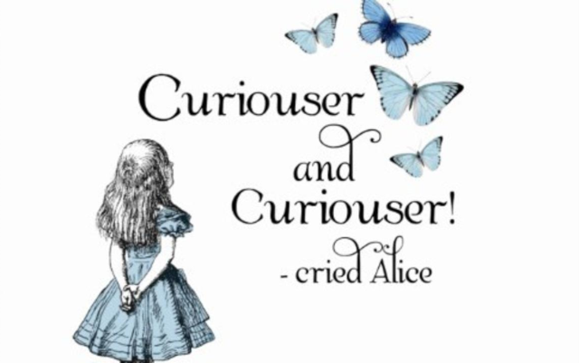

=========================
Software written in Prog8
=========================

Apart from the many `examples <https://github.com/irmen/prog8/tree/master/examples>`_ available in the source code repository,
there are also larger pieces of software written using Prog8. Here's a list.

`Assembler <https://github.com/irmen/cx16assem>`_
    File-based assembler for the Commander X16.

`Chess <https://github.com/irmen/cx16chess>`_
    Chess game for the Commander X16, with 2-player or computer opponent game modes.

`Image viewer <https://github.com/irmen/cx16imageviewer>`_
    Multi-format image viewer for the Commander X16.
    Can display cx16 BMX, C64 Koala, C64 Doodle, BMP, PCX and Amiga IFF images, including color cycling.

`Paint program <https://github.com/irmen/x16paint>`_
    Bitmap image paint program for the Commander X16, work in progress.

`Petaxian <https://github.com/cyborgar/Petaxian>`_
    Galaga type shoot em up game using only petscii graphics. Runs on C64 and Commander X16.

`Rock Runner <https://github.com/irmen/cx16rockrunner>`_
    Faithful Boulderdash clone, a well known arcade puzzle game from the 80's.
    where you must collect all diamonds in a level while avoiding the hazards to reach the exit.
    Can load the thousands of available fan made level files.
    This game is for the Commander X16.

`Shell <https://github.com/irmen/cx16shell>`_
    Unix like command shell for the Commander X16.

`Streaming Music Demo <https://github.com/irmen/cx16musicdemo>`_
    Demoscene like "music demos" for the Commander X16.
    They display graphics, animated song lyrics, and play a high quality sampled song streamed from disk.

Various things:

`GalaX16 and other programs <https://github.com/reltham/X16Prog8Code>`_
    Beginnings of a Galaga game for the Commander X16.

`Prog8 code for ZSMkit <https://github.com/mooinglemur/zsmkit/tree/main/p8demo>`_
    ZSMkit is an advanced music and sound effects engine for the Commander X16.

`vtsbank: a library for affine transformation and rotation of sprites and tiles <https://github.com/tallLeRoy/vtsbank>`_
    "VERA Tile Set and Sprite feature" is a module that provides all sorts
    of routines to perform tile and sprite transformations and rotation, using
    the VeraFX hardware feature. Includes examples.

