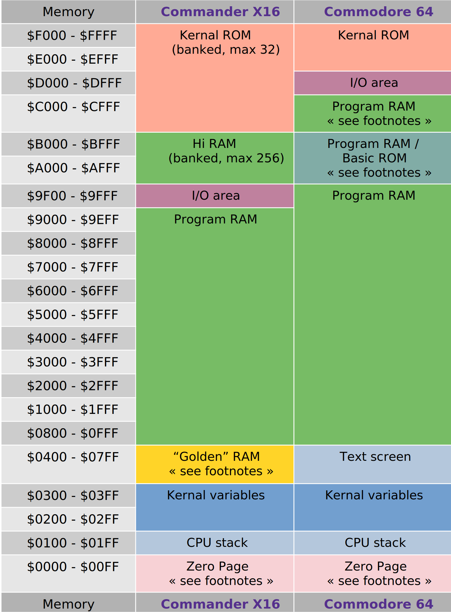

===========================
Target system specification
===========================

Prog8 targets the following hardware:

- 8 bit MOS 6502/65c02/6510 CPU
- 64 Kb addressable memory (RAM or ROM)
- optional use of memory-mapped I/O registers
- optional use of system ROM routines

Currently these machines can be selected as a compilation target (via the ``-target`` compiler argument):

- 'c64': the Commodore 64
- 'cx16': the `Commander X16 <https://www.commanderx16.com/>`_
- 'c128': the Commodore 128  (*limited support*)
- 'pet32': the Commodore PET 4032  (*limited support*)
- 'virtual': a builtin virtual machine

This chapter explains some relevant system details of the c64 and cx16 machines.

.. hint::
    If you only use standard Kernal and prog8 library routines,
    it is often possible to compile the *exact same program* for
    different machines (just change the compilation target flag)!

.. note::
    When you specify a file name as target, prog8 will try to read the target
    machine's configuration and properties from that configuration file instead.
    See :ref:`customizable_target` for details about this.

.. _customizable_target:

Customizable targets
====================

You can also specify a file name instead of one of the built in target machine names, when using the ``-target`` option.
In this case the compiler will not use one of the builtin machines configurations, but read it from the configuration file.
This allows you to define and change your own target machine configuration, and maybe allow Prog8 to generate
programs for new machines or existing ones it doesn't yet know about.

The configuration file should be a "properties" file (Java's ubiquitous configuration file format), which is basically a text file containing "key=value" lines.
The contents of the file is pretty extensive and it's easier to just look at some examples that are already included:
`target configuration examples <https://github.com/irmen/prog8/tree/master/examples/customtarget/>`_ .
The filename base part (the part before any suffix) of the target configuration file will be taken as the name of the compilation target.
If it matches one of the existing built-in compilation targets, the internal library files for that target will also be searched,
if the user supplied library location doesn't contain a replacement library file for anything that might get imported.
The path you need to provide for the ``library`` variable can be relative (to the current working directory where you launch the compiler from)
and you can use a tilde ``~`` in it like in a shell path, to refer to a user's home directory.
Note that library modules not unique to a specific compilation target (for example, `buffers`, `sorting` or `strings`) will
be picked up from the internal library files just fine as was always the case. You can still provide custom versions of them
in your own library folder ofcourse, like you already could with using the ``-srcdirs`` compiler flag.

Most of the things discussed in the :ref:`portingguide` can and must be configured properly in the target configuration file.
You also need to create some essential ``syslib`` library module for the configured target if its name does not match
one of the built in targets. This is because the compiler won't have a built in library that can be used this time.
The customtarget examples also show how to build the essentials.

The target configuration file also allows you to override the entire launcher assembly fragment that the compiler
usually puts at the start of the program (immediately after the setting of the program counter/load address and
the program start label). This allows you to have full control over exactly what code or data bytes appear at
the program's load address. But with great power comes great responsibility: you'll have to make sure you take
care of some very low level Prog8 internals if you want to support stuff such as the ``exit`` builtin function.
Maybe the best thing is to look at the code generated by the compiler for an existing target and adapt that.

Memory Model
============

Generic 6502 Physical address space layout
------------------------------------------

The 6502 CPU can address 64 kilobyte of memory.
Most of the 64 kilobyte address space can be used by Prog8 programs.
This is a hard limit: there is no support for RAM expansions or bank switching built natively into the language.

======================  ==================  ========
memory area             type                note
======================  ==================  ========
``$00``--``$ff``        zeropage            contains many sensitive system variables
``$100``--``$1ff``      Hardware stack      used by the CPU, normally not accessed directly
``$0200``--``$ffff``    Free RAM or ROM     free to use memory area, often a mix of RAM and ROM
                                            depending on the specific computer system
======================  ==================  ========

Memory map for the C64 and the X16
----------------------------------

This is the default memory map of the 64 Kb addressable memory for those two systems.
Both systems have ways to alter the memory map and/or to switch memory banks, but that is not shown here.
See :ref:`banking` for details about that.

Footnotes for the Commander X16
^^^^^^^^^^^^^^^^^^^^^^^^^^^^^^^
*Golden Ram $0400 - $07FF*
    *free to use.*

*Zero Page $0000 - $00FF*
    $00 and $01 are hardwired as Rom and Ram banking registers.

    $02 - $21 are the 16 virtual cx16 registers R0-R15.

    $22 - $7F are used by Prog8 to put variables in.

    The top half of the ZP ($80-$FF) is reserved for use by the Kernal and Basic in normal operation.
    Zero page use by Prog8 can be manipulated with the ``%zeropage`` directive, various options
    may free up more locations for use by Prog8 or to reserve them for other things.

Footnotes for the Commodore 64
^^^^^^^^^^^^^^^^^^^^^^^^^^^^^^

*Program RAM $C000-$CFFF*
    *free to use:* $C000 - $CFDF
    *reserved:* $CFE0 - $CFFF for the 16 virtual cx16 registers R0-R15

*Program RAM / BASIC ROM $A000-$BFFF*
    On the C64 the Basic ROM normally occupies this memory area. However Prog8 programs that do not
    use floating point variables, actually bank out the Basic ROM to reclaim the 8 Kb of RAM that
    is hidden below it. This means that all the memory from $0801 to $D000 (exclusive) is available
    as program ram to Prog8 programs.

*Zero Page $0000 - $00FF*
    Consider the full zero page to be reserved for use by the Kernal and Basic in normal operation.
    Zero page use by Prog8 can be manipulated with the ``%zeropage`` directive, various options
    may free up more locations for use by Prog8 or to reserve them for other things.

Zero page usage by the Prog8 compiler
-------------------------------------
Prog8 knows what addresses are safe to use in the various ZP handling configurations.
It will use the free ZP addresses to place its ZP variables in,
until they're all used up. If instructed to output a program that takes over the entire
machine, (almost) all of the ZP addresses are suddenly available and will be used.

**zeropage handling is configurable:**
There's a global program directive to specify the way the compiler
treats the ZP for the program. The default is to be reasonably restrictive to use the
part of the ZP that is not used by the C64's Kernal routines.
It's possible to claim the whole ZP as well (by disabling the operating system or Kernal).
If you want, it's also possible to be more restrictive and stay clear of the addresses used by BASIC routines too.
This allows the program to exit cleanly back to a BASIC ready prompt - something that is not possible in the other modes.

IRQs and the zeropage
^^^^^^^^^^^^^^^^^^^^^

The normal IRQ routine in the C64's Kernal will read and write several addresses in the ZP
(such as the system's software jiffy clock which sits in ``$a0 - $a2``):

``$a0 - $a2``; ``$91``; ``$c0``; ``$c5``; ``$cb``; ``$f5 - $f6``

These addresses will *never* be used by the compiler for ZP variables, so variables will
not interfere with the IRQ routine and vice versa. This is true for the normal ZP mode but also
for the mode where the whole system and ZP have been taken over.
So the normal IRQ vector can still run and will be when the program is started!

CPU
===

Directly Accessible Registers
-----------------------------

The hardware CPU registers (A, X, Y) are not directly accessible from regular Prog8 code.
If you need to work with them, you'll have to use some inline assembly with ``%asm``.
Or, if they are required to have a value as arguments to some external kernal or library assembly routine,
just use a normal subroutine call to an ``extsub`` that correctly specifies what registers go where.
The compiler will then take care of loading the arguments into the required registers and returning
any response value(s) back to the prog8 code.

The status register (P) carry flag and interrupt disable flag *can* be written via a couple of special
builtin functions (``set_carry()``, ``clear_carry()``, ``set_irqd()``,  ``clear_irqd()``),
and read via the ``read_flags()`` function.  With the special status branch statements like ``if_cc``,
``if_cs`` etc you can branch directly on the status of the flags.

The 16 'virtual' 16-bit registers that are defined on the Commander X16 machine are not real hardware
registers and are just 16 memory-mapped word values that you *can* access directly from everywhere.

IRQ Handling
============

Normally, the system's default IRQ handling is not interfered with.
You can however install your own IRQ handler (for clean separation, it is advised to define it inside its own block).
There are a few library routines available to make setting up 60hz/vsync IRQs and raster/line IRQs a lot easier (no assembly code required).

These routines are::

    sys.set_irq(uword handler_address)
    sys.set_rasterirq(uword handler_address, uword rasterline)
    sys.restore_irq()     ; set everything back to the systems default irq handler

The IRQ handler routine must return a boolean value (0 or 1) in the A register:
0 means do *not* run the system IRQ handler routine afterwards, 1 means run the system IRQ handler routine afterwards.

**CommanderX16 specific notes**

.. sidebar::
    X16 specific routines

    For the X16 there are also some specialized IRQ handling routines, see  :ref:`x16-specific-irq` below.

Note that for the CommanderX16 the set_rasterirq() will disable VSYNC irqs and never call the system IRQ handler regardless
of the return value of the user handler routine. This also means the default sys.wait() routine won't work anymore,
when using this handler.

These two helper routines are not particularly suited to handle multiple IRQ sources on the Commander X16.
It's possible but it requires correct fiddling with IRQ enable bits, acknowledging the IRQs, and properly calling
or not calling the system IRQ handler routine. See the section below for perhaps a better and easier solution that
is tailored to this system.

The Commander X16 syslib provides some additional routines that should be used *in your IRQ handler routine* if it uses the Vera registers.
They take care of saving and restoring the Vera state of the interrupted main program, otherwise the IRQ handler's manipulation
will corrupt any Vera operations that were going on in the main program. The routines are::

    cx16.save_vera_context()
    ; perhaps also cx16.save_virtual_registers() here... see caution below
    ; ... do your work that uses vera here!...
    ; perhaps also cx16.restore_virtual_registers() here... see caution below
    cx16.restore_vera_context()

.. caution::
    The Commander X16's 16 'virtual registers' R0-R15 *are not preserved* in the IRQ handler! (On any system!)
    So you should make sure that the handler routine does NOT use these registers, or do some sort of saving/restoring yourself
    of the ones that you do need in the IRQ handler.  Note that Prog8 itself may also use these registers, so be very careful.
    This is not a X16 specific thing; these registers also exist on the other compiler targets, and the same
    issue holds there.

    There are two utility routines in cx16 that save and restore *all* 16 registers. It's a bit inefficient if
    only a few are clobbered, but it's easy to put calls to them into your IRQ handler routine at the start and end.
    These routines are ``cx16.save_virtual_registers()`` and ``cx16.restore_virtual_registers()``.

    It is also advised to **not use floating point calculations** inside IRQ handler routines.
    Beside them being very slow, there are intricate requirements such as having the
    correct ROM bank enabled to be able to successfully call them (and making sure the correct
    ROM bank is reset at the end of the handler), and the possibility
    of corrupting variables and floating point calculations that are being executed
    in the interrupted main program. These memory locations should be backed up
    and restored at the end of the handler, further increasing its execution time...

.. _x16-specific-irq:

Commander X16 specific IRQ handling
===================================

Instead of using the routines in ``sys`` as mentioned above (that are more or less portable
across the C64,C128 and cx16), you can also use the special routines made for the Commander X16,
in ``cx16``. The idea is to let Prog8 do the irq dispatching and housekeeping for you, and that
your program only has to register the specific handlers for the specific IRQ sources that you want to handle.

Look at the examples/cx16/multi-irq-new.p8 example to see how these routines can be used.
Here they are, all available in ``cx16``:

``disable_irqs ()``
    Disables all Vera IRQ sources. Note that the CPU irq disable flag is not changed by this routine.
    you can manipulate that via ``sys.set_irqd()`` and ``sys.clear_irqd()`` as usual.

``enable_irq_handlers (bool disable_all_irq_sources)``
    Install the "master IRQ handler" that will dispatch IRQs to the registered handler for each type.
    Only Vera IRQs supported for now.
    Pass true to initially disable all Vera interrupt sources (they will be enabled individually again
    by setting the various handlers), or pass false to not touch this.
    The handlers don't need to clear its ISR bit, but have to return 0 or 1 in A,
    where 1 means: continue with the system IRQ handler, 0 means: don't call that.
    The order in which the handlers are invoked if multiple interrupts occur simultaneously is: LINE, SPRCOL, AFLOW, VSYNC.

``set_vsync_irq_handler (uword address)``
    Sets the verical sync interrupt handler routine.  Also enables VSYNC interrupts.

``set_line_irq_handler (uword rasterline, uword address)``
    Sets the rasterline interrupt handler routine to trigger on the specified raster line.
    Also enables LINE interrupts.
    You can use ``sys.set_rasterline()`` later to adjust the rasterline on which to trigger.

``set_sprcol_irq_handler (uword address)``
    Sets the sprite collision interrupt handler routine.  Also enables SPRCOL interrupts.

``set_aflow_irq_handler (uword address)``
    Sets the audio buffer underrun interrupt handler routine.  Also enables AFLOW interrupts.
    Note: the handler must fill the Vera's audio fifo buffer by itself with at least 25% worth of data (1 kb)
    otherwise the aflow irq keeps triggering.

``disable_irq_handlers ()``
    Hand control back to the system default IRQ handler.
