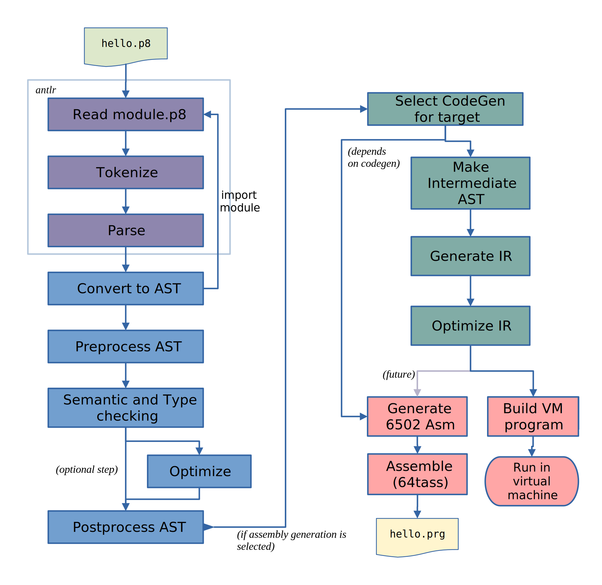

*****************
Technical details
*****************

All variables are static in memory
----------------------------------

All variables are allocated statically, there is no concept of dynamic heap or stack frames.
Essentially all variables are global (but scoped) and can be accessed and modified anywhere,
but care should be taken of course to avoid unexpected side effects.

Especially when you're dealing with interrupts or re-entrant routines: don't modify variables
that you not own or else you will break stuff.

Variables that are not put into zeropage, will be put into a special 'BSS' section for the assembler.
This section is usually placed at the end of the resulting program but because it only contains empty space
it won't actually increase the size of the resulting program binary.
Prog8 takes care of properly filling this memory area with zeros at program startup and then reinitializes
the subset of variables that have a nonzero initialization value.

Arrays with initialization values are not put into BSS but just occupy a sequence of bytes in
the program memory: their values are not reinitialized at program start.

It is possible to relocate the BSS section using a compiler option
so that more system ram is available for the program code itself.


.. _banking:

ROM/RAM bank selection
----------------------

On certain systems prog8 provides support for managing the ROM or RAM banks that are active.

======= ============================================= ===========
system  get banks (returns byte)                      set banks
======= ============================================= ===========
c64     ``c64.getbanks()``                            ``c64.banks(x)``
c128    ``c128.getbanks()``                           ``c128.banks(x)``
cx16    ``cx16.getrombank()`` , ``cx16.getrambank()`` ``cx16.rombank(x)`` , ``cx16.rambank(x)`` ,
                                                      ``cx16.push_rombank(x)``, ``cx16.pop_rombank()`` ,
                                                      ``cx16.push_rambank(x)``, ``cx16.pop_rambank()``
other   N/A                                           N/A
======= ============================================= ===========

Calling a subroutine in another memory bank can be done by using the ``callfar`` or ``callfar2`` builtin functions.

When you are using the routines above, you are doing explicit manual banks control.
However, Prog8 also provides something more sophisticated than this, when dealing with banked subroutines:

External subroutines defined with ``extsub`` can have a non-standard ROM or RAM bank specified as well.
The compiler will then transparently change a call to this routine so that the correct bank is activated
automatically before the normal jump to the subroutine (and switched back on return). The programmer doesn't
have to bother anymore with setting/resetting the banks manually, or having the program crash because
the routine is called in the wrong bank!  You define such a routine by adding ``@bank <bank>``
to the extsub subroutine definition. This specifies the bank number where the subroutine is located in.
You can use a constant bank number 0-255, or a ubyte variable to make it dynamic::

    extsub @bank 10  $C09F = audio_init()
    extsub @bank banknr  $A000 = first_hiram_routine()

When you then call this routine in your program as usual, the compiler will no longer generate a simple JSR instruction to the
routine. Instead it will generate a piece of code that automatically switches the ROM or RAM bank to the
correct value, does the call, and switches the bank back. The exact code will be different for different
compilation targets, and not all targets even have banking or support this. As an example,
on the Commander X16, prog8 will use the JSRFAR kernal routine for this. On the Commodore 128,
a similar call exists (but requires a lot more code to prepare, so beware).
On the Commodore 64 some custom code is also emitted that toggle the banks, retains some registers, and does the call.
Other compilation targets don't have banking or prog8 doesn't yet support automatic bank selection on them.

There's a "banking" example for the Commander X16 that shows a possible application
of the extsub with bank support, check out the :source:`bank example code <examples/cx16/banking>` .


Notice that the symbol for this routine in the assembly source code will still be defined as usual.
The bank number is not translated into assembly (only as a comment)::

	p8s_audio_init = $c09f ; @bank 10

.. caution::
    Calls with automatic bank switching like this are not safe to use from IRQ handlers. Don't use them there.
    Instead change banks in a controlled manual way (or not at all).

.. note::
    On the C64 and C128, the Basic ROM is *banked out* by default when running a Prog8 program, because
    it is not needed. This means on the C64 we get access to another 8Kb of RAM at that
    memory area, which actually gives us a 50 Kb contiguous RAM block from $0801 to $d000 (exclusive).
    This means you can create programs of up to **50 Kb** size with prog8 on the C64.
    On the C128, it means programs can use ~41 Kb of contiguous RAM at $1c00 to $c000 (exclusive).
    However, if your program uses floats, Prog8 *does* need the Basic ROM for the floating point routines,
    and it won't be banked out. Such programs are limited to the regular size of about 38 Kb on the C64, and less on the C128.
    Be aware that the bank setting is only done if you are *not* using ``%option no_sysinit`` because the
    program's bootstrap code is what initializes the memory bank configuration.


.. _symbol-prefixing:

Symbol prefixing in generated Assembly code
-------------------------------------------

*All* symbols in the prog8 program will be prefixed in the generated assembly code:

================ ========
Element type     prefix
================ ========
Block            ``p8b_``
Subroutine       ``p8s_``
Variable         ``p8v_``
Constant         ``p8c_``
Label            ``p8l_``
Struct           ``p8t_``
Struct Field     ``p8v_``
other            ``p8_``
================ ========

This is to avoid naming conflicts with CPU registers, assembly instructions, etc.
So if you're referencing symbols from the prog8 program in inlined assembly code, you have to take
this into account. Stick the proper prefix in front of every symbol name component that you want to reference that is coming
from a prog8 source file.
All elements in scoped names such as ``main.routine.var1`` are prefixed so this becomes ``p8b_main.p8s_routine.p8v_var1``.

.. attention::
    Symbols from library modules are *not* prefixed and can be used
    in assembly code as-is. So you can write::

        %asm {{
            lda  #'a'
            jsr  cbm.CHROUT
        }}


Subroutine Calling Convention
-----------------------------

Calling a subroutine requires three steps:

#. preparing the arguments (if any) and passing them to the routine.
   Numeric types are passed by value (bytes, words, longs, booleans, floats),
   but array types passed by reference which means as ``uword`` being a pointer to their address in memory.
   Strings are passed as a pointer to a byte: ``^^ubyte``.
#. calling the subroutine
#. preparing the return value (if any) and returning that from the call.

*There is no stack handling involved: Prog8 doesn't have call stack frames.*


Regular subroutines
^^^^^^^^^^^^^^^^^^^

- Each subroutine parameter is represented as a variable scoped to the subroutine. Prog8 doesn't have a call stack.
- The arguments passed in a subroutine call are evaluated by the caller, and then put into those variables by the caller.
  The order of evaluation of subroutine call arguments *is unspecified* and should not be relied upon.
- The subroutine is invoked.
- The return value is not put into a variable, but the subroutine passes it back to the caller via register(s). See below.

.. sidebar::
    **Builtin functions can be different:**

    some builtin functions are special and won't exactly follow the rules in this paragraph.

**Single arguments will often be passed in registers:**

For *single* byte, word, and pointer arguments (not long or float), the values are simply loaded in cpu registers by the caller before calling the subroutine.
*The subroutine itself will take care of putting the values into the parameter variables.* This saves on code size because
otherwise all callers would have to store the values in those variables themselves.
Note that his convention is also still used for subroutines that specify parameters to be put into
one of the *virtual registers* R0-R15, as those are in the end just variables too.
The rules are as follows:

Single byte parameter: ``sub foo(ubyte bar) { ... }``
   gets bar in the accumulator A, *subroutine* stores it into parameter variable

Two byte parameters: ``sub foo(ubyte bar, ubyte baz) { ... }``
   gets bar in the accumulator A, and baz in Y, *subroutine* stores it into parameter variable

Single word parameter: ``sub foo(uword bar) { ... }``
    gets bar in the register pair A + Y (lsb in A, msb in Y), *subroutine* stores it into parameter variable

Single pointer parameter: ``sub foo(^^ubyte bar) { ... }``
    gets bar in the register pair A + Y (lsb in A, msb in Y), *subroutine* stores it into parameter variable

Long or Floating point parameter: ``sub foo(long bar) { ... }``, ``sub foo(float bar) { ... }``
    value for bar gets stored into the parameter variable *by the caller*

Other: ``sub foo(ubyte bar, ubyte baz, ubyte zoo) { ... }``
   not using registers; all values get stored in the subroutine's parameter variables *by the caller*


**Return value**

- A byte return value will be put in ``A`` .
- A boolean return value will be put in ``A`` too, as 0 or 1.
- A word return or pointer value will be put in ``A`` + ``Y`` register pair (lsb in A, msb in Y).
- A long return value will be put into ``cx16.r0 : cx16.r1`` (2 combined word registers to make up a single 32 bits long) *Note: this may change in the future to maybe R14+R15 instead, to reduce the chance of overwriting registers that are already used*
- A float return value will be put in the ``FAC1`` float 'register'.

In case of *multiple* return values:

  - for an ``asmsub`` or ``extsub`` the subroutine's signature specifies the output registers that contain the values explicitly,
    just as for a single return value.
  - for regular subroutines, the compiler will return the first of the return values via the cpu register ``A``` (or ``A + Y``` if it's a word value),
    just like for subroutines that only return a single value.
    The remainder of the return values are returned via the "virtual registers" cx16.r16-cx16.r0 (using R15 first and counting down to R0).
    Long values will take a pair of those "virtual registers" that combined make up a single 32 bits value.
    A floating point value is passed via FAC1 as usual (only a single floating point value is supported,
    using FAC1 and FAC2 together unfortunately interferes with the values).


``asmsub`` and ``extsub`` routines
^^^^^^^^^^^^^^^^^^^^^^^^^^^^^^^^^^

These are kernal (ROM) routines or low-level assembly routines, that get their arguments via specific registers.
Sometimes even via a processor status flag such as the Carry flag.
Note that word values can be put in a "CPU register pair" such as AY (meaning A+Y registers) but also
in one of the 16 'virtual' 16 bit registers introduced by the Commander X16, R0-R15.
Float values can be put in the FAC1 or FAC2 floating point 'registers'.
The return values also get returned via designated registers, or via processor status flags again.
This means that after calling such a routine you can immediately act on the status
via a special branch instruction such as ``if_z`` or ``if_cs`` etc.
The register/status flag usage is fully specified in the asmsub or extsub signature defintion
for both the parameters and the return values::

    extsub $2000 = extfunction(ubyte arg1 @A, uword arg2 @XY, uword arg3 @R0,
                               float frac @FAC1, bool flag @Pc) -> ubyte @Y, bool @Pz

    asmsub function(ubyte arg1 @A, uword arg2 @XY, uword arg3 @R0,
                    float frac @FAC1, bool flag @Pc) -> ubyte @Y, bool @Pz {
        %asm {{
            ...
            ...
        }}
    }


Compiler Internals
------------------

Here is a diagram of how the compiler translates your program source code into a binary program:



Some notes and references into the compiler's source code modules:

#. The ``compileProgram()`` function (in the ``compiler`` module) does all the coordination and basically drives all of the flow shown in the diagram.
#. ANTLR is a Java parser generator and is used for initial parsing of the source code. (``parser`` module)
#. Most of the compiler and the optimizer operate on the *Compiler AST*. These are complicated
   syntax nodes closely representing the Prog8 program structure. (``compilerAst`` module)
#. For code generation, a much simpler AST has been defined that replaces the *Compiler AST*.
   Most notably, node type information is now baked in. (``codeCore`` module, Pt- classes)
#. An *Intermediate Representation* has been defined that is generated from the simplified AST. This IR
   is more or less a machine code language for a virtual machine - and indeed this is what the built-in
   prog8 VM will execute if you use the 'virtual' compilation target and use ``-emu`` to launch the VM.
   (``intermediate`` and ``codeGenIntermediate`` modules, and ``virtualmachine`` module for the VM related stuff)
   Note that this IR is still *targeted to one specific compilation target only*; various properties and all library
   code for the selected target machine is encoded into the IR. It is *not possible* to eventually create a C64 program
   from an IR file crated for the CommanderX16 target.
#. The code generator backends all implement a common interface ``ICodeGeneratorBackend`` defined in the ``codeCore`` module.
   Currently they get handed the program Ast, Symboltable and several other things.
   If the code generator wants it can use the ``IRCodeGen`` class from the ``codeGenIntermediate`` module
   to convert the Ast into IR first. The VM target uses this, but the 6502 codegen doesn't right now.


Run-time memory profiling with the X16 emulator
-----------------------------------------------

The compiler has the ``-dumpvars`` switch that will print a list of all variables and where they are placed into memory.
This can be useful to track which variables end up in zeropage for instance. But it doesn't really show if the choices
made are good, i.e. if the variables that are actually the most used in your program, are placed in zeropage.

But there is a way to actually *measure* the behavior of your program as it runs on the X16.
See it as a simple way of *profiling* your program to find the hotspots that maybe need optimizing:

The X16 emulator has a ``-memorystats`` option that enables it to keep track of memory access count statistics,
and write the accumulated counts to a file on exit.
Prog8 then provides a Python script ``profiler.py`` (find it in the "scripts" subdirectory of the source code distribution,
or :source:`online here <scripts/profiler.py>`).
This script cross-references the memory stats file with an assembly listing of the program, produced by the Prog8 compiler with the ``-asmlist`` option.
It then prints the top N lines in your (assembly) program source that perform the most reads and writes,
which you can use to identify possible hot spots/bottlenecks/variables that should be better placed in zeropage etc.
Note that the profiler simply works with the total number of accesses to memory locations.
This is *not* the same as the most run-time (cpu instructions cycle times aren't taken into account at all)!
Here is an example of the output it generates::

    $ scripts/profiler.py -n 10 cobramk3-gfx.list memstats.txt                                                                             ✔

    number of actual lines in the assembly listing: 2134
    number of distinct addresses read from  : 22006
    number of distinct addresses written to : 8179
    total number of reads  : 375106285 (375M)
    total number of writes : 63601962 (63M)

    top 10 most reads:
    $007f (7198687) : $007e 'P8ZP_SCRATCH_W2' (line 13), $007e 'remainder' (line 1855)
    $007e (6990527) : $007e 'P8ZP_SCRATCH_W2' (line 13), $007e 'remainder' (line 1855)
    $0265 (5029230) : unknown
    $007c (4455140) : $007c 'P8ZP_SCRATCH_W1' (line 12), $007c 'dividend' (line 1854), $007c 'result' (line 1856)
    $007d (4275195) : $007c 'P8ZP_SCRATCH_W1' (line 12), $007c 'dividend' (line 1854), $007c 'result' (line 1856)
    $0076 (3374800) : $0076 'label_asm_35_counter' (line 2082)
    $15d7 (3374800) : $15d7 '9c 23 9f               stz  cx16.VERA_DATA0' (line 2022), $15d7 'label_asm_34_repeat' (line 2021)
    $15d8 (3374800) : $15d7 '9c 23 9f               stz  cx16.VERA_DATA0' (line 2022), $15d7 'label_asm_34_repeat' (line 2021)
    $15d9 (3374800) : $15da '9c 23 9f               stz  cx16.VERA_DATA0' (line 2023)
    $15da (3374800) : $15da '9c 23 9f               stz  cx16.VERA_DATA0' (line 2023)

    top 10 most writes:
    $9f23 (14748104) : $9f23 'VERA_DATA0' (line 1451)
    $0265 (5657743) : unknown
    $007e (4464393) : $007e 'P8ZP_SCRATCH_W2' (line 13), $007e 'remainder' (line 1855)
    $007f (4464393) : $007e 'P8ZP_SCRATCH_W2' (line 13), $007e 'remainder' (line 1855)
    $007c (4416537) : $007c 'P8ZP_SCRATCH_W1' (line 12), $007c 'dividend' (line 1854), $007c 'result' (line 1856)
    $007d (3820272) : $007c 'P8ZP_SCRATCH_W1' (line 12), $007c 'dividend' (line 1854), $007c 'result' (line 1856)
    $0076 (3375568) : $0076 'label_asm_35_counter' (line 2082)
    $01e8 (1310425) : cpu stack
    $01e7 (1280140) : cpu stack
    $0264 (1258159) : unknown

Apparently the most cpu activity while running this program is spent in a division routine which uses the 'remainder' and 'dividend' variables.
As you can see, sometimes even actual assembly instructions end up in the tables above if they are in a routine that is executed very often (the 'stz' instructions in this example).
The tool isn't powerful enough to see what routine the variables or instructions are part of, but it prints the line number in the assembly listing file so you can investigate that manually.

You can see in the example above that the variables that are among the most used are neatly placed in zeropage already.
If you see for instance a variable that is heavily used and that is *not* in zeropage, you
could consider adding ``@zp`` to that variable's declaration to prioritize it to be put into zeropage.


.. _romable:

ROM-able programs
-----------------

Normally Prog8 will use some tricks to generate the smallest and most optimized code it can.
This includes the following techniques that by default prevent generated program code from running in ROM:

self-modifying code
    This is program code that actually modifies itself during program execution (instructions or operands are modified)
    When the program is in ROM, such modifications are impossible, so the program will not execute correctly.

inline variables
    These are variables that are located in the same memory region that the program code is in (or even interleaved within the program code).
    Again, writing to such variables will not work when it is in ROM, so the program will not execute correctly.

(Not all prog8 source code will end up using these techniques but you should not depend on it.)

The directive ``%option romable`` changes this behavior.
It tells the compiler to no longer generate code using these two tricks, and instead revert to slightly slower running code (or needing more instructions)
but which *is* able to run from ROM.
There are a few things to note:

- string variables and array variables that are initialized with something other than just zeros, *are no longer mutable*.
  This is because both of these will still end up as part of the same memory region the program code is in (which will be ROM).
  The compiler will try to detect writes to them and give an error if these occur. However it cannot detect all such writes, so beware.
- arrays without an initialization literal will be placed into the memory region for variables instead which can and should be placed in RAM,
  so those arrays *are* mutable as usual.
- the same holds for memory blocks allocated using the ``memory`` function; nothing changes for them.
- the memory region for variables and memory blocks (BSS sections) should be explicitly placed in RAM memory.
  You can do this with the ``-varsgolden`` or ``-varshigh``, and ``-slabsgolden`` or ``-slabshigh`` command line options.
  Maybe in the future an option will be added to choose a memory address for those manually.

.. note::
    The ROMable code generation is still quite experimental. Problems may still surface, and perhaps
    stuff will change a bit in a future compiler version.